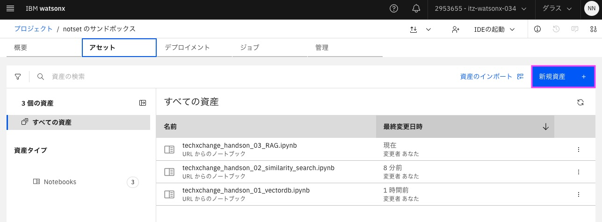
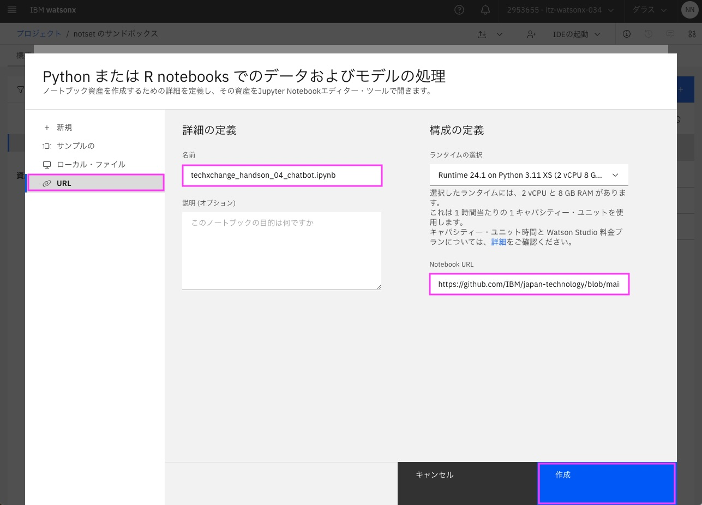

# Notebookを開く: 4. ベクトルDB Milvusとwatsonx.ai LLMでRAGを構成して、チャットアプリを作成してみよう!
## 前提　
プロジェクトが開いた状態であること

### 1. 「アセット」タブをクリックし、「新規資産」をクリック


### 2. 左側のナビゲージョンから 「モデルの処理」をクリックし、「Python または R notebooks でのデータおよびモデルの処理」のタイルをクリック


### 3. Notebook URLを入れて、Jupyter Notebookエディター・ツールで開く
左側のナビゲージョンから 「URL」を選択し、「名前」と「Notebook URL」に以下の名前を入力します。

名前:<br>
以下の名前をコピーし、ペーストして入力します。
```
techxchange_handson_04_chatbot
```


Notebook URL:<br>
以下のURLをコピーし、ペーストして入力します。
```
https://github.com/IBM/japan-technology/blob/main/techxchange/2024-watsonx-handson-1/notebooks/techxchange_handson_04_chatbot.ipynb
```

入力後、「作成」をクリックし、Jupyter Notebookエディター・ツールで開きます。<br>


その後は開いたNotebookの記載に従って、実行してください。

---
[ハンズオンの実施 - 「4. ベクトルDB Milvusとwatsonx.ai LLMでRAGを構成して、チャットアプリを作成してみよう!」に戻る](02_hands_on_guide.md#4-ベクトルdb-milvusとwatsonxai-llmでragを構成してチャットアプリを作成してみよう)<br><br>


