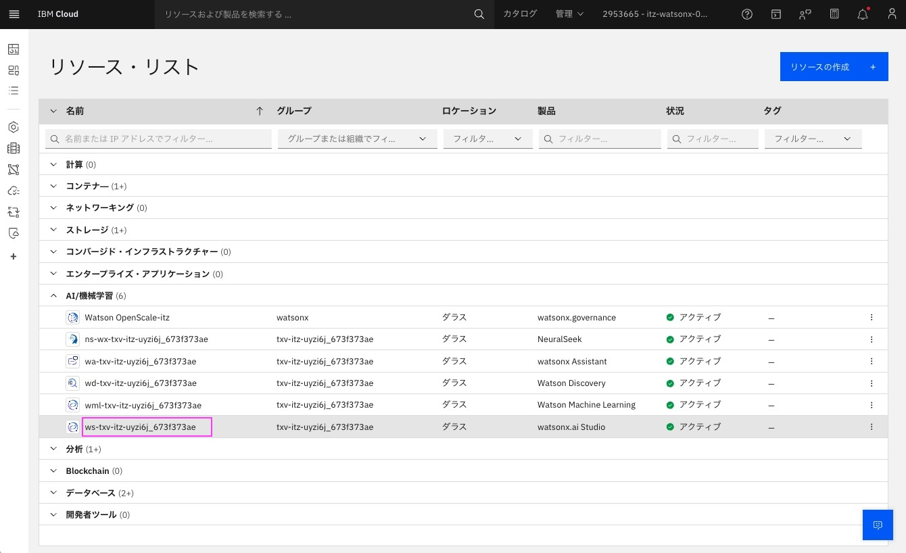

# wastonx.ai: Watson Studioの立ち上げ　

前提：
[ワークショップ環境へのアクセス](01_techzone_use_environments.md)が完了し、IBM CloudのダッシュボードがWebブラウザーに表示されていることが前提です。
 

## 1. wastonx.dataへのアクセス
### 1-1. リソースリストの表示
左上のナビゲーション・メニューをクリック後、「リソース・リスト」をクリックし、IBM Cloudのリソース・リストを開きます。 
 
 

### 1-2. watsonx.aiのリソースの表示
リソース・リストから[AI/機械学習]のグループを見つけて、その中に含まれている Watson Studio のサービスを見つけて、表示されている名前をクリックします。
 

### 1-3. watsonx.ai トップページの表示
watsonx.aiのリソースが表示されるので、[Launch in][v]の[v]をクリックして、表示されたメニューから[watsonx]を選びます。
 
&nbsp; 
&nbsp; 
watsonx.dataのトップページが開きます。「watsonxへようこそ」というウィンドウが表示された場合は右上の[X]をクリックして閉じてください。
 

### 1-4. サンドボックス・プロジェクトを開く
プロジェクトとは、特定の目標を達成するために、データ、プロンプト、コードを実行する資産などを含めることができるものです。 プロジェクトは他のユーザーと共同作業することができます。またプロジェクトをZIPファイルとしてエクスポートし、他のユーザーへ共有することもできます。

今回使用するサンドボックス・プロジェクトは最初のwatson.ai利用時に自動的に作成されるプロジェクトです。

IBM watsonx のトップページから、[最近の作業]欄にある[プロジェクト]のタイルを見つけ、 その中にある`notsetのサンドボックス`(`notset`は違う文字列になる可能性があります)をクリックします。
 
&nbsp; 
&nbsp; 
`notsetのサンドボックス`プロジェクトが開きました。
 

---
[ハンズオンの実施 - トップページに戻る](02_hands_on_guide.md) 
