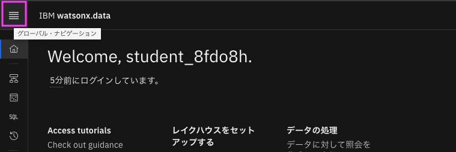
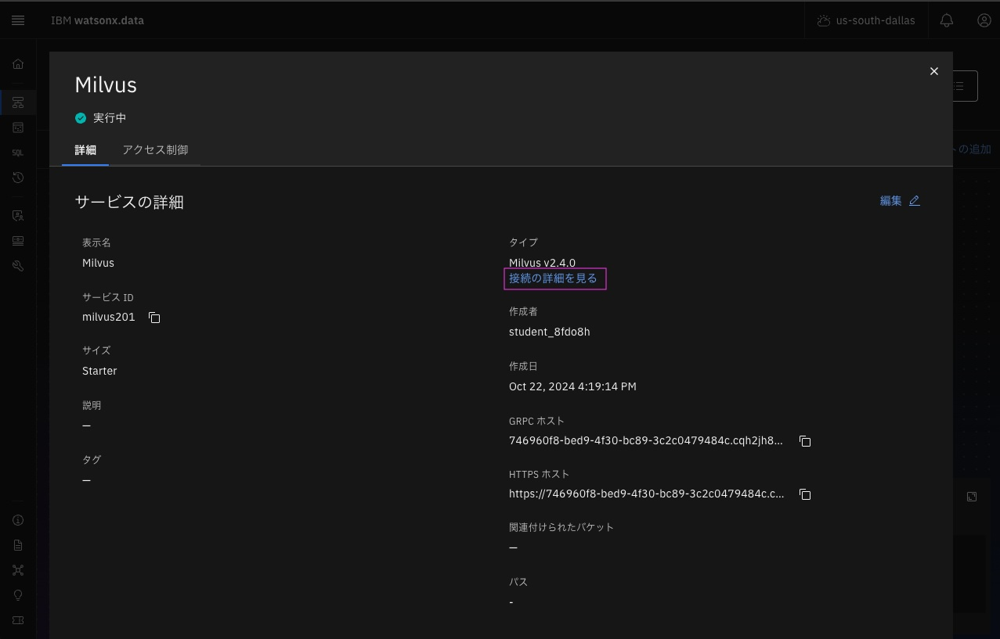

# wastonx.data: Milvus 接続情報の取得
前提：
[ワークショップ環境へのアクセス](01_techzone_use_environments.md)が完了し、IBM CloudのダッシュボードがWebブラウザーに表示されていることが前提です。
 

## 1. wastonx.dataへのアクセス
### 1-1. リソースリストの表示
左上のナビゲーション・メニューをクリック後、「リソース・リスト」をクリックし、IBM Cloudのリソース・リストを開きます。 
 
 

### 1-2. watsonx.dataのリソースの表示
リソース・リストから[データベース]のグループを見つけて、その中に含まれている watsonx.data のサービスを見つけて、表示されている名前をクリックします。 
 

### 1-3. watsonx.dataのコンソールの表示
watsonx.dataのリソースが表示されるので、「Webコンソールを開く」をクリックします
 
&nbsp; 
通常管理者が初回にwatsonx.dataを開く際、設定画面が表示され最初にエンジンの設定が必要ですが、今回は事前にIBMが設定済みです。 
watsonx.dataのダッシュボードが開きます。
 

## 2. Milvus情報の表示
### 2-1. インフラストラクチャー・マネージャーの表示
左上のグローバル・ナビゲーションをクリック後、「インフラストラクチャー・マネージャー」をクリックし、インフラストラクチャー・マネージャーを開きます。 
 
&nbsp; 

&nbsp; 
&nbsp; 
インフラストラクチャー・マネージャーが表示されます

### 2-2. Milvus情報の表示
通常Milvusのサービスは「コンポーネントの追加」から作成する必要がありますが、今回はMilvusのサービスは事前にIBMが作成済みです。
サービスにある「Milvus」アイコンをクリックします。

&nbsp; 
&nbsp; 
Mivusの情報が表示されます。 

### 2-3. Milvus 接続の詳細の表示
タイプの下にある「接続の詳細を見る」をクリックします。

&nbsp; 
&nbsp; 
接続の詳細が表示されます。 

### 2-4 GRPC ホストおよびGRPC ポートの値を取得
GRPC ホストおよびGRPC ポートの値はハンズオンで使用しますので、この2つの値をどこかにコピー＆ペーストしてしてわかるようにしておいてください。またはこのWeb画面を表示し必要な時に取得できるようにしておいてください。

値は右側のコピーアイコンをクリックすれば、クリップボードにコピーできます。

&nbsp; 
&nbsp; 
詳細画面を閉じるには、下の「Close」　ボタンをクリックします。

---
[ハンズオンの実施 - 「2. wastonx.ai: Watson Studioの立ち上げ」に進む](02_hands_on_guide.md#2-wastonxai-watson-studioの立ち上げ) 

