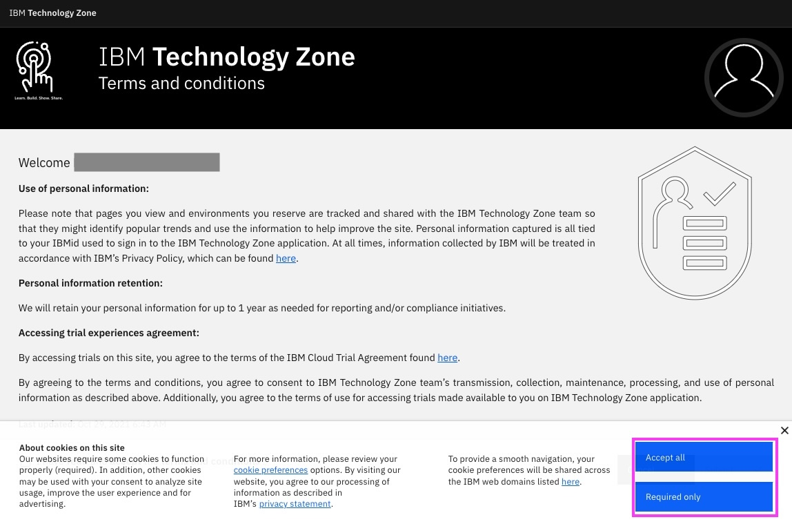
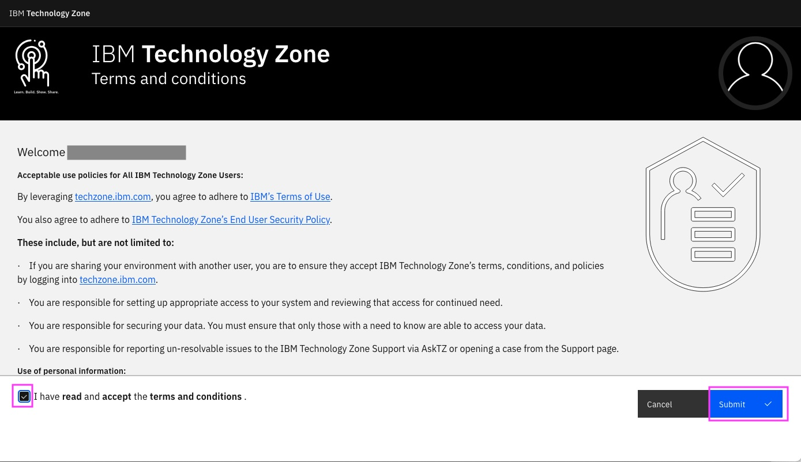
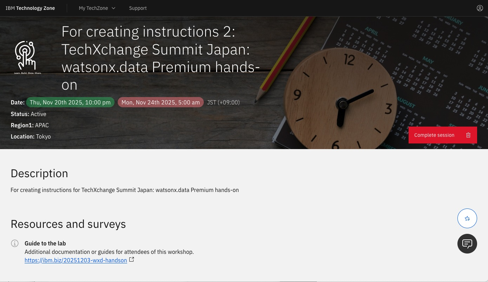
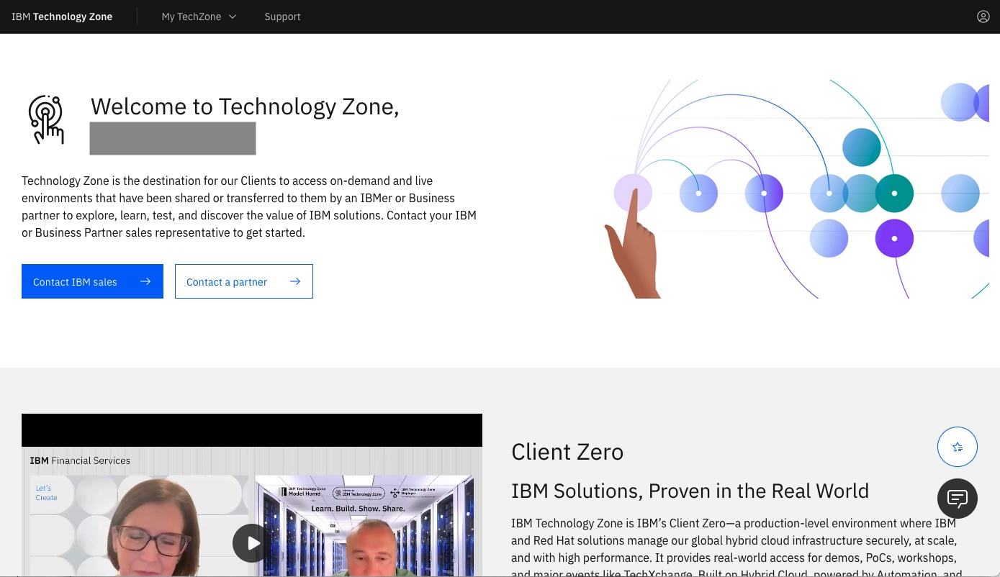
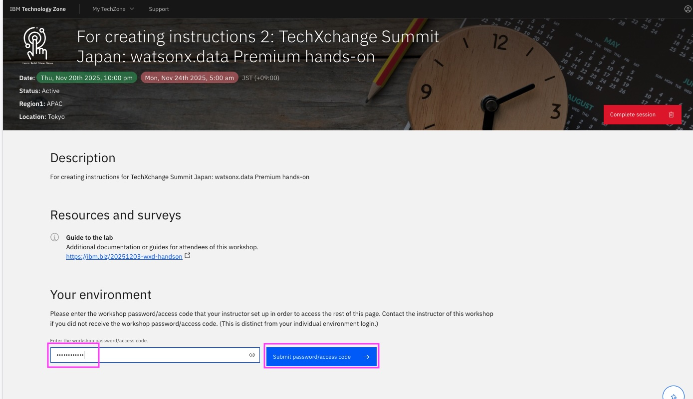
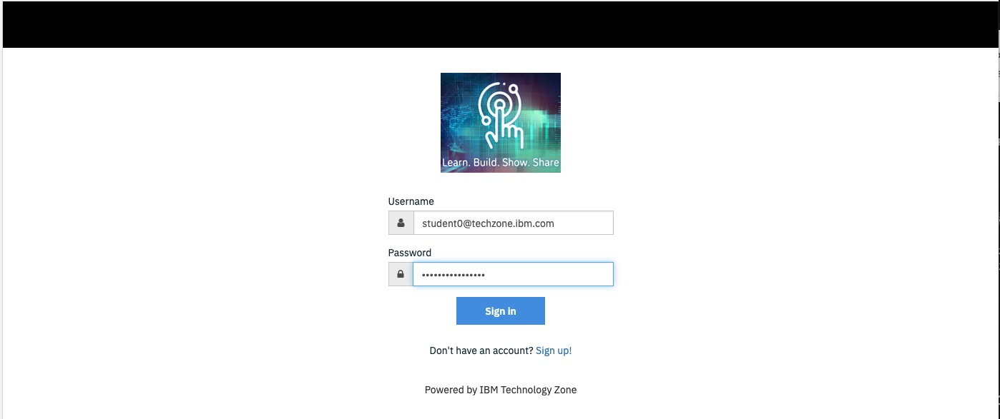
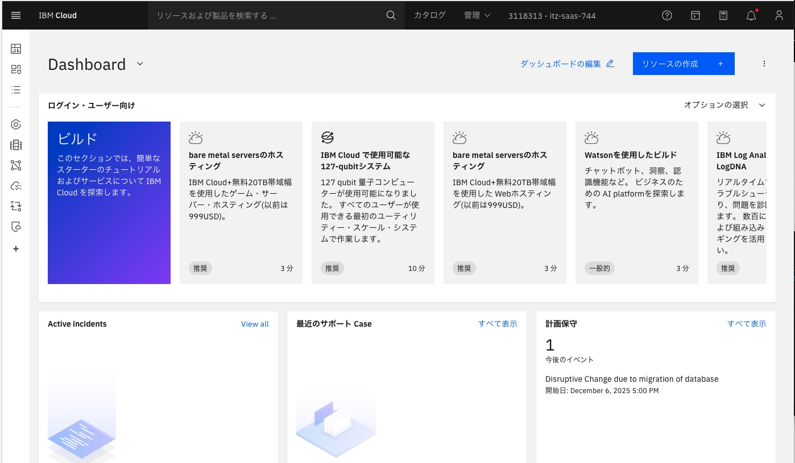

# ワークショップ環境へのアクセス
前提：
[ワークショップ環境の事前準備](00_techzone_environments_preparation.md)が実施していることが前提です。
実施していない場合は、まず[ワークショップ環境の事前準備](00_techzone_environments_preparation.md)を実施してください。

## 1. TechZone初期登録
こちらの初期登録は一度実施すれば次回ログインからは不要です。 
既に初期登録を実施済みの方は「[2. 「TechZoneランディングページ」からIBM Cloud 環境にアクセス](#2-techzoneランディングページからibm-cloud-環境にアクセス)」に進んでください。

### 1-1. 「TechZoneランディングページ」にアクセス
講師から指示のあった「TechZoneランディングページ」にWebブラウザーでアクセスします。 
URLは当日講師が提示します。 

### 1-2. IBM idでのログイン
IBM idでのログインが必要ですので、準備したIBM idでログインしてください。 
 

### 1-3.cookieの許可
cookieの許可の画面が下部に表示された場合は、「Accept all」か「Required only」のどちらかをクリックしてください。 

### 1-4.IBM Technology Zone Terms and conditionsのAccept
表示された「IBM Technology Zone Terms and conditions」を読んで、問題なければ、 
`I have read and accept the terms and conditions.`にチェックを入れ、「Submit」をクリックしてください。 

### 1-5:「Welcome to IBM Technology Zone! Tell us about yourself.」をSkip
「Welcome to IBM Technology Zone! Tell us about yourself.」というウィンドウが表示されたら、「Skip for now」をクリックしてください。 

### 1-6: 「TechZoneランディングページ」 または「　IBM Technology Zoneのトップ画面」が表示されます
以下は 「TechZoneランディングページ」 です。このページが表示された場合は　[2. 「TechZoneランディングページ」からIBM Cloud 環境にアクセス](#2-techzoneランディングページからibm-cloud-環境にアクセス)に進んでください。 
 
&nbsp; 

以下は「IBM Technology Zoneのトップ画面」 です。このページが表示された場合は再度講師から指示のあった「TechZoneランディングページ」のURLを入力して「TechZoneランディングページ」を表示させます。 

## 2. 「TechZoneランディングページ」からIBM Cloud 環境にアクセス
### 2-1. 「TechZoneランディングページ」にアクセス
下記のような「TechZoneランディングページ」が表示されてない場合は、講師から指示のあった「TechZoneランディングページ」にWebブラウザーで再びアクセスします。 
尚、前回のログインから時間が経っていると IBM idでのログイン画面が出ることがあります。　その場合は再度ログインお願いします。 
 
&nbsp; 

### 2-2. パスワードを入力し、「Submit password/access code」をクリック
「Enter the workshop password/access code.」
に講師が提示したパスワードを入力し、 
「Submit password/access code」をクリックします。 
 
&nbsp; 

尚、使用したIBM idのメールアドレスに「Account: Action required: You are invited to join an account in IBM Cloud」というSubjectのメールが`no-reply@cloud.ibm.com`より送付されますが、無視してください。特にアクションは不要です。 
&nbsp; 
送付されるメールの例： 
 
&nbsp; 

### 2-3. Workshop環境の情報が表示されます
使用するのは以下の4つです 
- App ID Instructionsの中のURL
- App ID User Credentialsの中のUsernameとPassword

#### ログインURL
`App ID Instructions`の中に記載されているURLがログインURLです。上の方に表示されている`IBM Cloud Login URL`ではありませんのでご注意ください。 

以下のような文章が表示されいるので、この中に記載されている`https://` から始まるURLがログインURLとなります。

<kbd></kbd> 
&nbsp; 

`App ID Instructions`の中のURLをクリップボードにコピーしてください。 
Webブラウザーで新しいタブを開いて、URL入力フィールドにペーストしてログインURLにアクセスしてください。

#### Username, Password
`App ID User Credentials`にあります。上の方に表示されている`IBM Cloud Username (your email)`および`IBM Cloud Password (user must provide their own)`ではありませんのでご注意ください。 
最初の`@techzone.ibm.com`で終わる文字列がUsername, スペースの後の2番目の文字列がPasswordです。 
ログインURLにアクセスして表示されたページのフォームにそれぞれコピーして入力してください。 
<kbd></kbd> 

### 2-4. ログインURLをWebブラウザーの新しいタブで開き,　Username, Passwordを使ってIBM Cloudにログインします。 
必ずWebブラウザーの**新しい**タブで開いてください。 
「TechZoneランディングページ」のタブはあとで使うので閉じずに残しておいてください。 

 
&nbsp; 

ログインが成功するとIBM Cloudのダッシュボードが表示されます 
 
&nbsp; 

---
[ watsonx.dataでらくらく、非構造化データ取込&高精度RAGを実現 - 「02. ハンズオン実施」に進む](README.md#02-ハンズオン実施)

