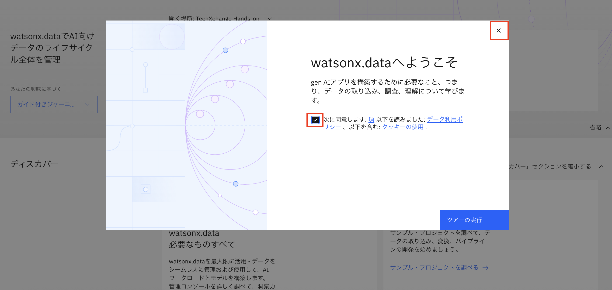
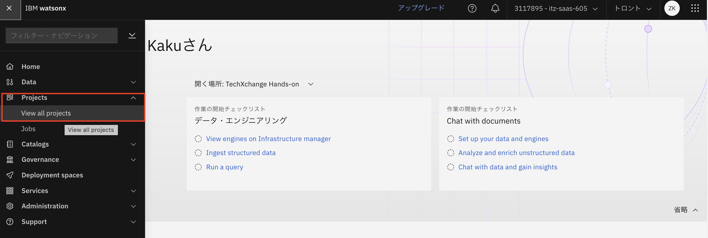
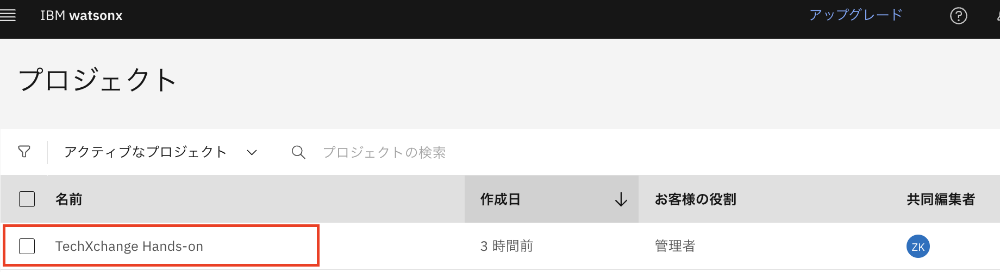
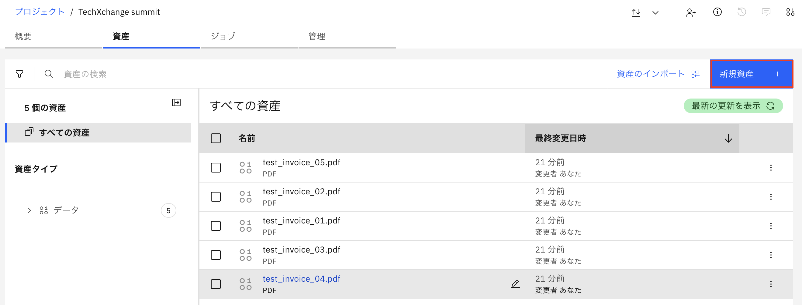
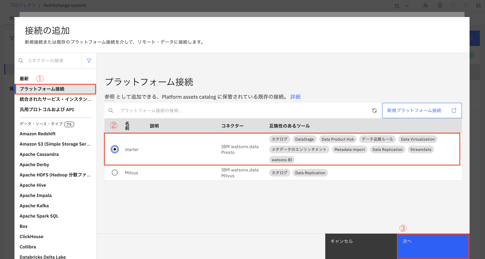
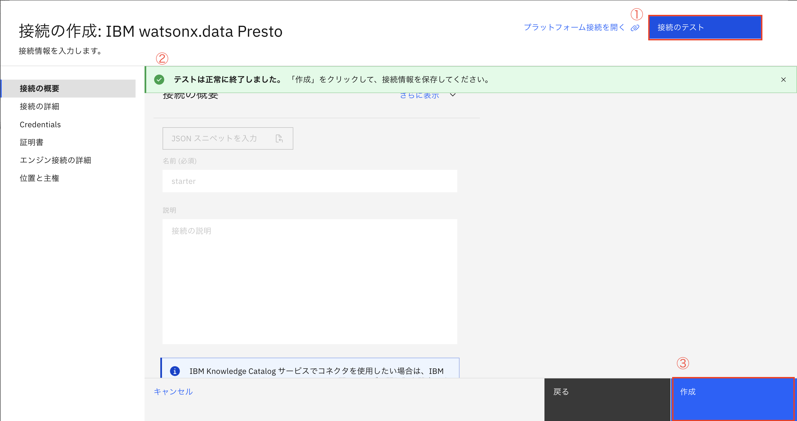
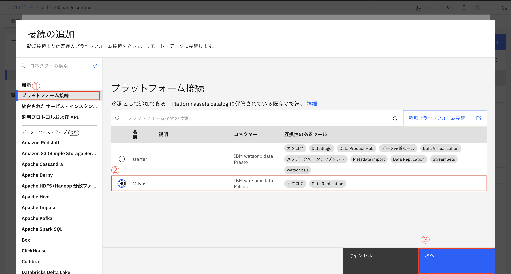
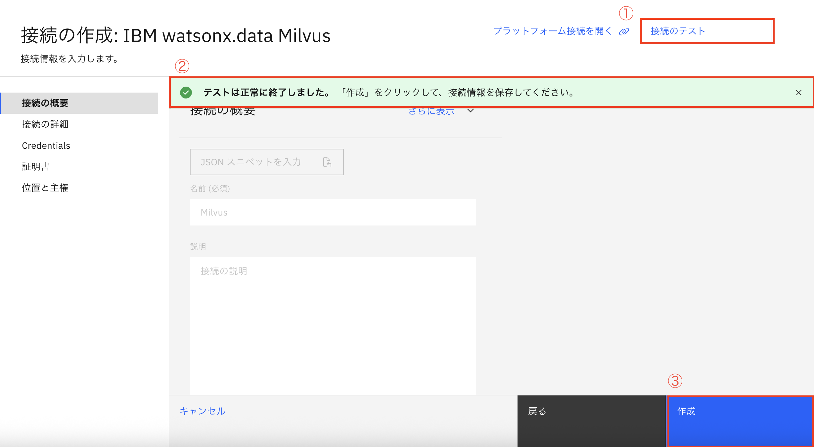
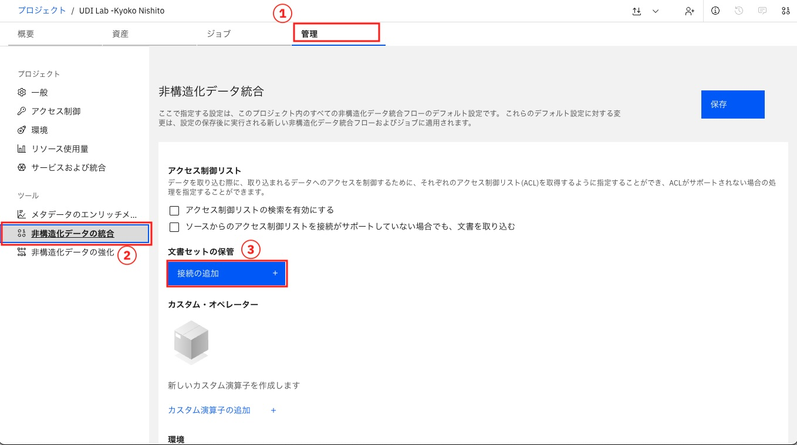
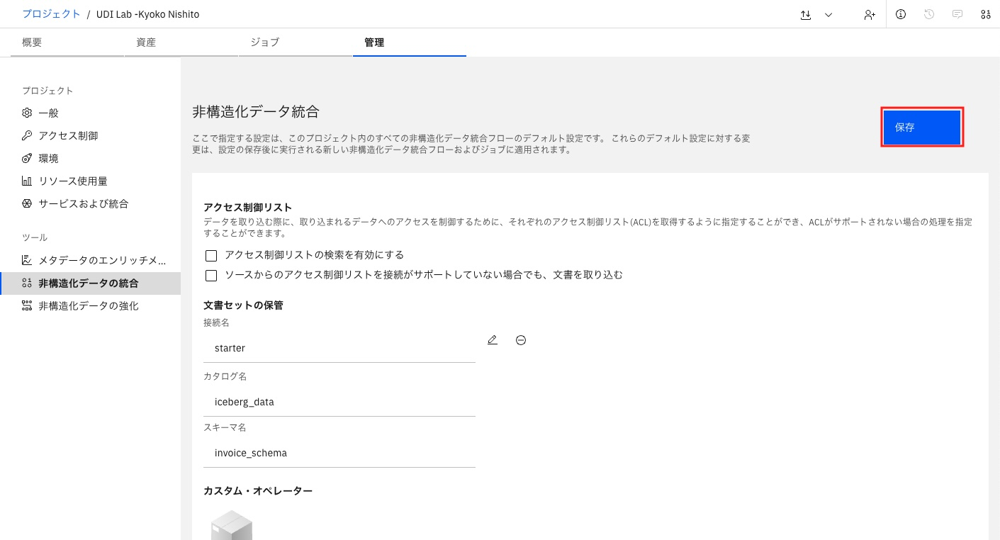

# 1. wastonx.dataへのアクセスと接続準備
### 1-1 watsonx.dataの立ち上げ
1.左上のハンバーガーメニューをクリックし、メニュー下部の「watsonx」を選択します。
  

 2.watsonx コンテキストに入ったら、右側の「watsonx.data」の下にある「起動」ボタンをクリックします。
  

 3.チェックボックスをクリックし、右上の✕ボタンをクリックします。 
  

 4.ログイン後、右上で、トロント・リージョンにいて、IBM watsonx.dataコンテキストに切り替えっていることを確認します。（プロファイルの右側のアイコンをクッリクします） 
  

### 1-2 プロジェクトに入る
1.左上のナビゲーションアイコンをクリックし、[**Project**]の下の[**View all project**]をクリックします。 
 

2.[**TechXchange Hands-on**]というプロジェクトをクリックします。 
※ 時間の都合上、プロジェクトは事前に準備されています。 
 

### 1-3 watsonx.data Presto への接続

watsonx.data は、SQLクエリ、Spark、ベクトル検索などをサポートするマルチエンジン・アーキテクチャを提供します。コアエンジンの1つであるwatsonx.data Prestoに接続することで、構造化データと非構造化データを検索・変換・加工を行うことができます。 

プラットフォーム・レベルで watsonx.data Presto 接続をすでにセットアップ済みなので、Presto接続をプロジェクトに追加します。

1.「**新規資産**」をクリックし、「**データソースへの接続**」をクリックします。 
 
 

2.[接続の追加]画面で、次の操作を行います。 
- ①「**プラットフォーム接続**」をクリックします。 
- ②「IBM watsonx.data Presto」コネクター「**stater**」を選択します。 
- ③「**次へ**」をクリックします。 
 

3.[接続の作成]画面で、次の操作を行います。 
- ① [接続のテスト]をクッリクしてセットアップを確認します。
- ② 緑色「**テストは正常に終了しました。**」が表示を確認します。
- ③ 右下の「**作成**」をクッリクします。 
 

これで、watsonx.data Presto接続がプロジェクトに追加されました。

### 1-4 watsonx.data Milvusへの接続
Milvusはwatsonx.dataに統合されたベクターデータベースです。この接続により、PDFなどの非構造化コンテンツから生成されたベクトル埋め込みを保存し、インデックス化や検索ができるようになります。 
同様に、 watsonx.data Milvus接続もプラットフォームレベルで作成済みです。 

1.前述と同様に、「**新規資産**」をクリックし、「**データソースへの接続**」をクリックします。 
 
 

2.[接続の追加]画面で、次の操作を行います。 
- ①「**プラットフォーム接続**」をクリックします。 
- ②「IBM watsonx.data Milvus」コネクター「**Milvs**」を選択します。 
- ③「**次へ**」をクリックします。 
 

3. [接続の作成]画面で、次の操作を行います。 
- ① [接続のテスト]をクッリクしてセットアップを確認します。
- ② 緑色「**テストは正常に終了しました。**」が表示を確認します。
- ③ 右下の「**作成**」をクッリクします。  
 

これで、watsonx.data Milvus接続がプロジェクトに追加されました。

### 1-5  非構造化データストレージ用のPrestoの設定
非構造化データを取り込む前に、Prestoをストレージエンジンとして設定します。抽出したメタデータをIcebergテーブルに保存し、後でPrestoから簡単にクエリできるようになります。 

セットアップ手順は次のとおりです。

1.プロジェクトで、画面上部の「**管理**」タブをクリックし(①)、左側の「**ツール**」メニューで「**非構造化データの統合**」を選択します(②)。 「文書セットの保管」の下にある青いボタン「**接続の追加**」をクリックします。(③) 
 

2.「**コネクションの定義**」ウィンドウで、次の操作を行います。
- ① 前のStepで追加したPresto接続「starter」をクリックして展開します。 
- ② カタログ「iceberg_data」を展開します。 
- ③ スキーマ「invoice_schema」を選択します。 
- ④ 右下の「選択」をクリックします。 

 

3.「**保存**」をクリックします。 
 

次に、作成したプロジェクト内にで非構造化データキュレーション資産を作成します。 
 [非構造化データのキューレーション（Unstructured data curation：UDC）](02_02_UDC.md)
 