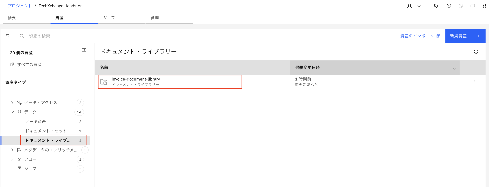
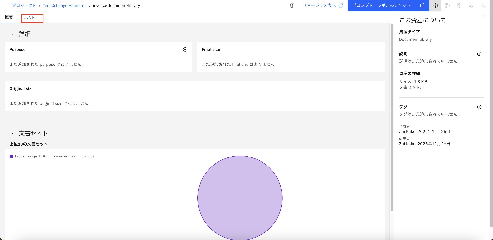
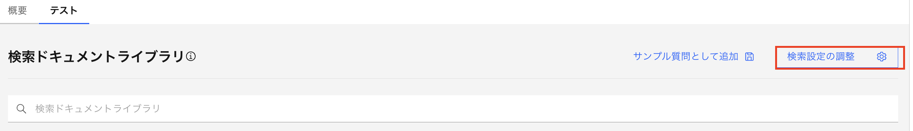
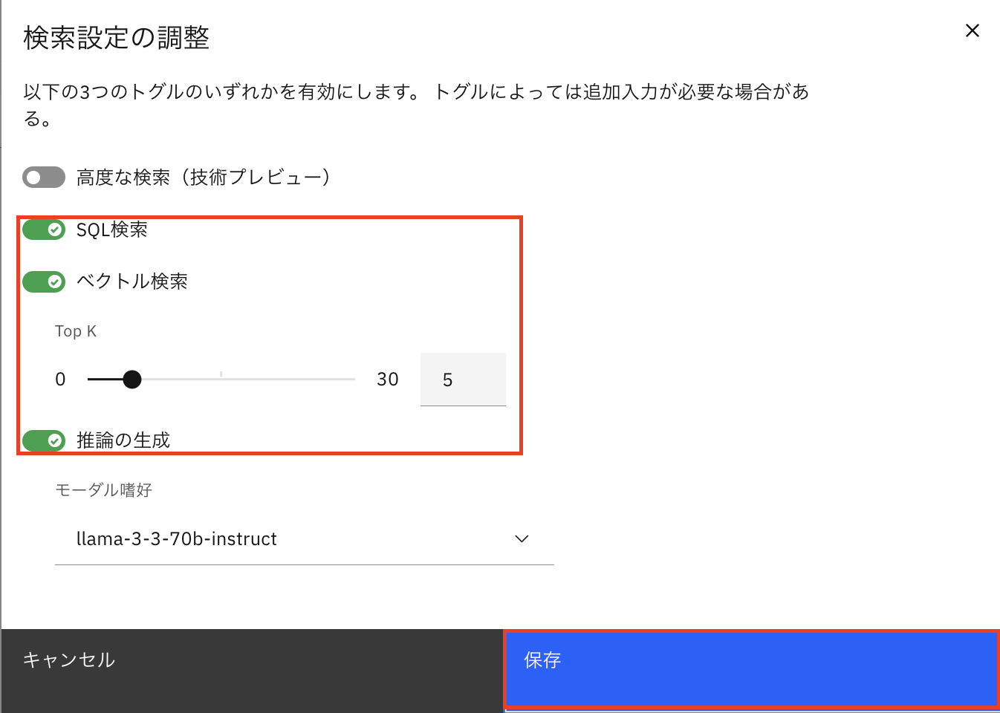
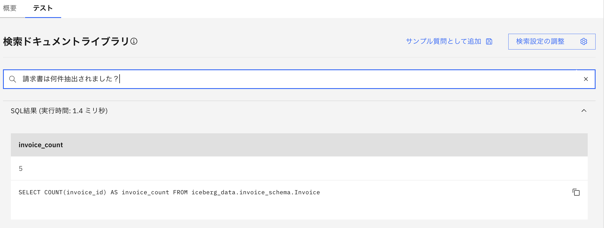
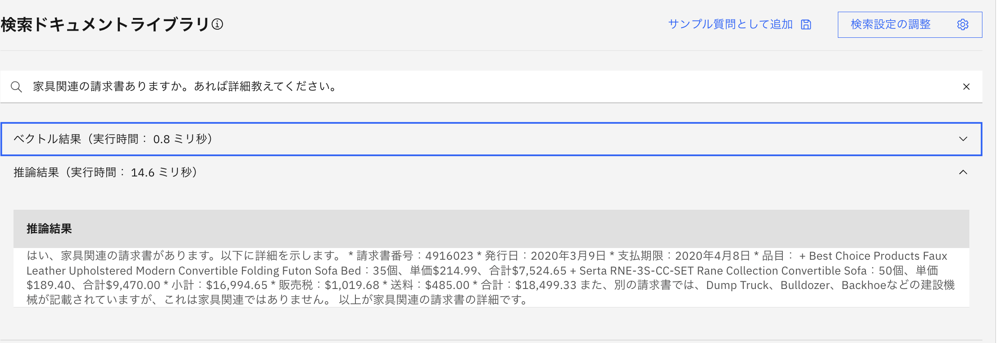
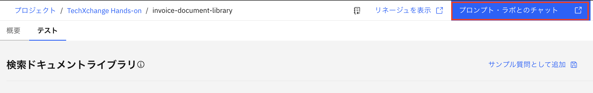
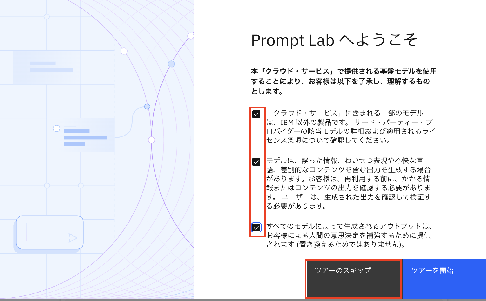
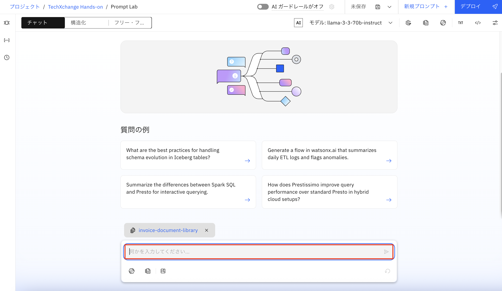
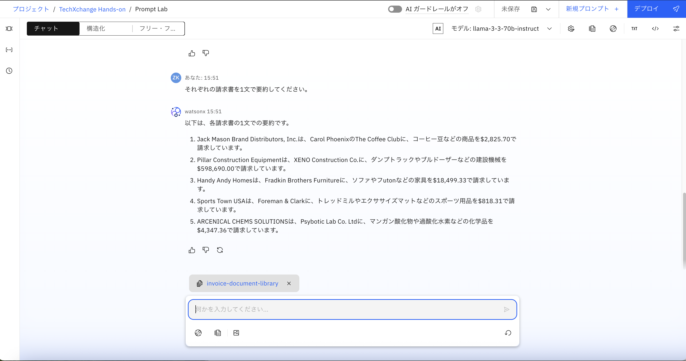

# 3.ドキュメントライブラリを使用してテストする。
このセクションでは、ドキュメントライブラリを使用して、取り込んだドキュメントセットとチャットを実行します。

1.「**資産**」タブを選択し、左側のデータの下にある「**ドキュメント・ライブラリ**」を選択し、「**invoice-document-library**」をクリックします。 
 

2.上の「**テスト**」タブを選択します。 
 

3.「**検索設定の調整**」を選択し、以下の設定を行います： 
- 「**SQL検索**」トグルをオン 
- 「**ベクトル検索**」をオン 
- 「**TopK**」を「5」に設定 
- 「**推論の生成**」をオン 
設定後、［保存］をクリックします。 
 
 

4.検索ドキュメントライブラリの入力欄に、次の質問を入力し、Enterキーを押します。 
「How many invoices are ingested?」(日本語訳：請求書は何件抽出されました？)。 

実行結果が表示されました。 
 
・SQL結果:自然言語がSQLに変換され、その結果が表示されています。 
・推論結果:SQL結果を参照して取り込まれたドキュメントの数が表示されます。 

次に、もう一つの質問を入れてみましょう。 
「家具関連の請求書ありますか。あれば詳細教えてください」 
 
この質問は、キーワードや意味の類似性に基づく検索が適しているため、ベクトル検索のみが自動的に使用されました。 
- ベクトル検索の結果：類似度の高い請求書ドキュメントが返されます（TopKで指定した件数）。 
- 推論結果：ベクトル検索で取得したドキュメントを参照し、回答を生成します。 

### 次に、プロンプト・ラボとチャットします。 
ここでは、SQLやベクトル検索の結果は表示されず、通常のチャットと同じように、入力した質問に対して自然言語で回答が返されます。 

5.右上の青いボタン「**プロンプト・ラボとのチャット**」をクリックします。 
 

6.ツアーが表示された場合は、スキップします。 
 

7.下のチャット欄に、自然言語で質問を入力します。 
 

 

質問の例： 
(もし英語で回答された場合は、「日本語で回答してください」と入力してください)
- それぞれの請求書の合計金額はいくらですか？ 
- それぞれの請求書を1文で要約してください。 
- どの請求書の合計金額が大きいですか？ 
- その請求書の詳しい情報を教えてください 
- 請求書にプロモーション情報が含まれていますか？ 
- List all items mentioned in the invoice. 
- Who is the seller in each invoice? 