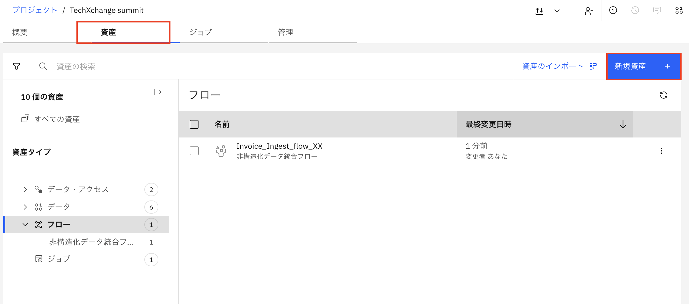
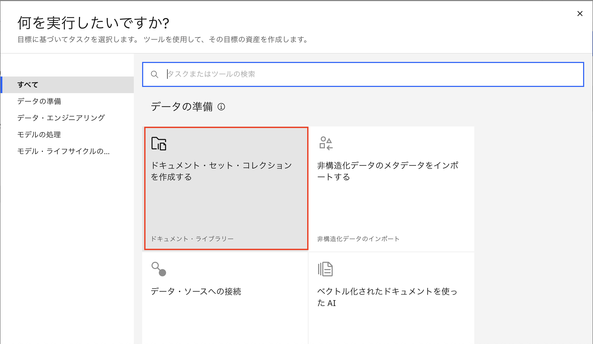
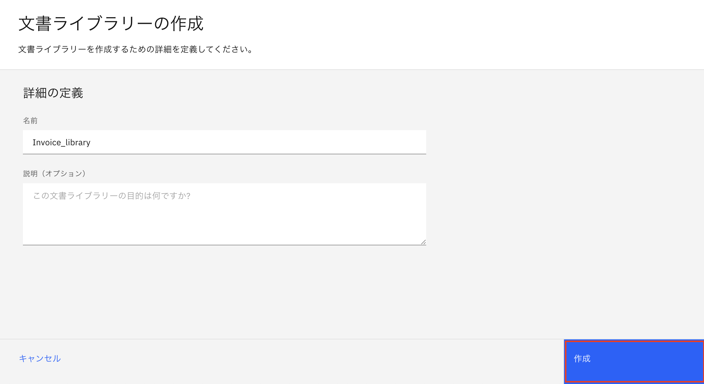
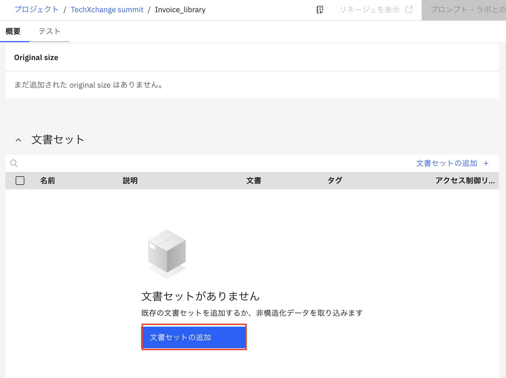
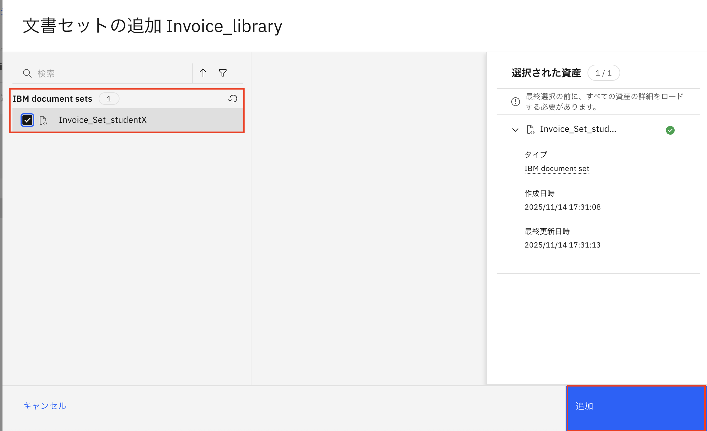
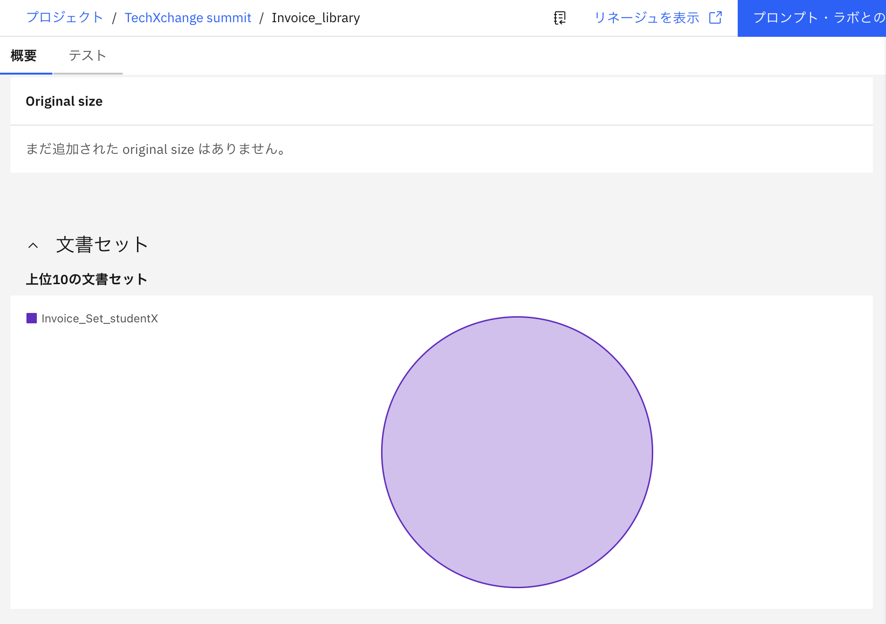

# 3.ドキュメントライブラリの設定
ドキュメントライブラリは、Chat with Promptラボでの検索のコンテキストとして機能するドキュメントセットのコレクションです。 

1.プロジェクト名をクリックして、プロジェクトに戻ります。
 

2.「**資産**」タブを選択し、「**新規資産**」をクリックします。 
 

3.「**ドキュメント・セット・コレクションを作成する**」を選択します。 
 

4.名前を指定し（例：「Invoice_library」）、「**作成**」をクリックします。
 

5.下にある「**文書セットの追加**」を選択します。 
 

6.前のステップで作成したドキュメントセットが表示されます。ドキュメントセットを選択して、「**追加**」をクリックします。 
 

7.文書セットの追加が完了しました。 
 

次に、取り込んだドキュメントセットとチャットを実行します。
- [ドキュメントライブラリを使用してテストする](02_04_test.md)
