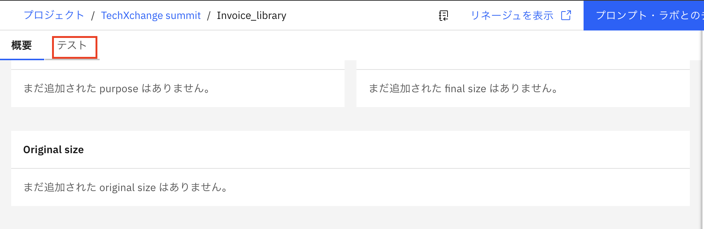
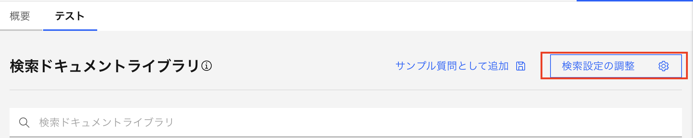
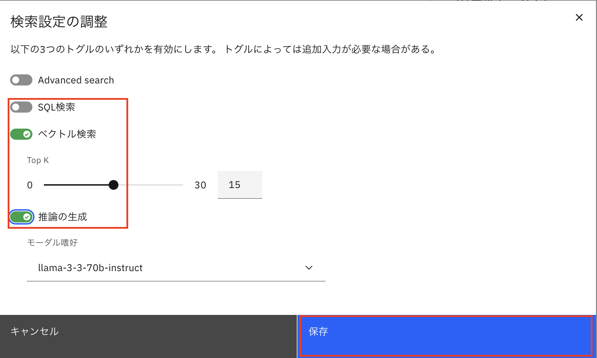
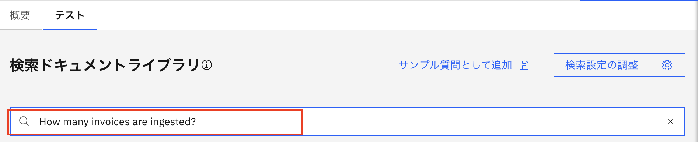
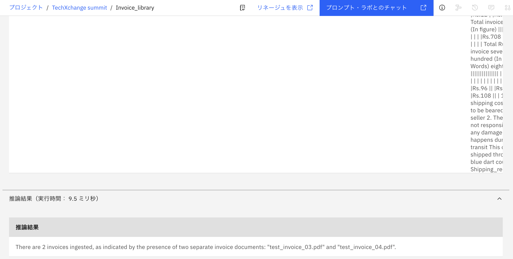
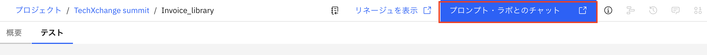
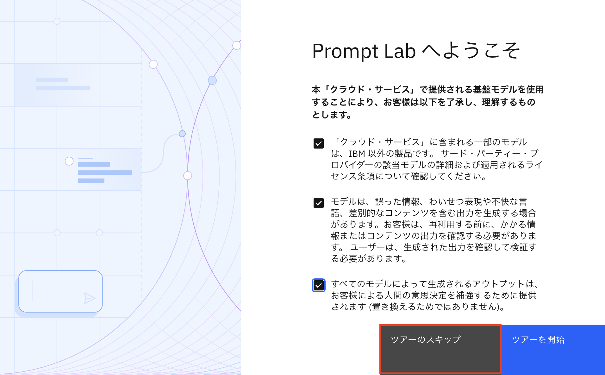
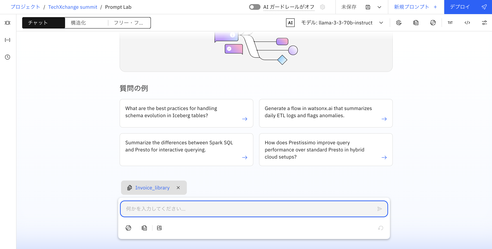
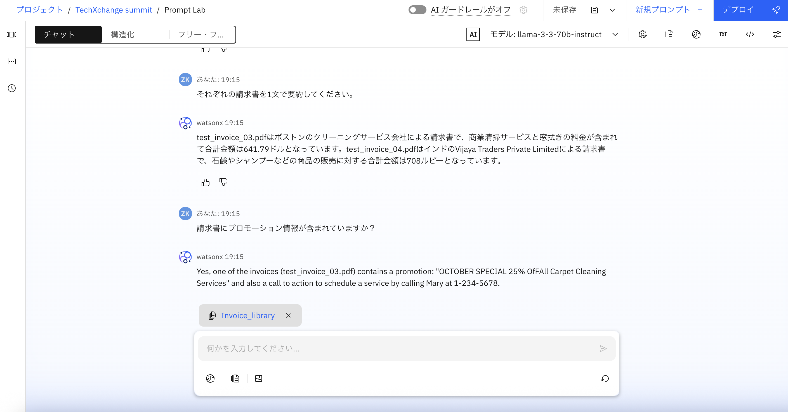

# 4.ドキュメントライブラリを使用してテストする。
このセクションでは、ドキュメントライブラリを使用して、作成されたドキュメントセットに接続し、取り込んだドキュメントセットとチャットを実行します。

1.「**テスト**」タブを選択します。 
 

2.「**検索設定の調整**」を選択し、「**SQL検索**」トグルをオフにし、「**ベクトル検索**」をオンにし、「**推論の生成**」をオンにします。保存をクッリクします。 
 
 

3.検索ドキュメントライブラリフィールドに、「 How many invoices are ingested?」と入力し、Enter キーを押します。 
 

4.推論結果には、取り込まれたドキュメントの数に基づくカウントが表示されます。 
 

次に、プロンプト・ラボとチャットします。 

5.右上の青いボタン「**プロンプト・ラボとのチャット**」をクリックします。 
 

6.ツアーをスキップします。 
 

7.下のチャット欄に、自然言語で質問を入力します。 
 

 

質問の例： 
- What is the quantity and unit price of Bathing soap? 
- Who is the seller in each invoice? 
- List all items mentioned in the invoice. 
- それぞれの請求書の合計金額はいくらですか？ 
- どちらの請求書の合計金額が大きいですか？ 
- それぞれの請求書を1文で要約してください。 
- 請求書にプロモーション情報が含まれていますか？ 
- 請求書の支払い条件は何ですか？ 