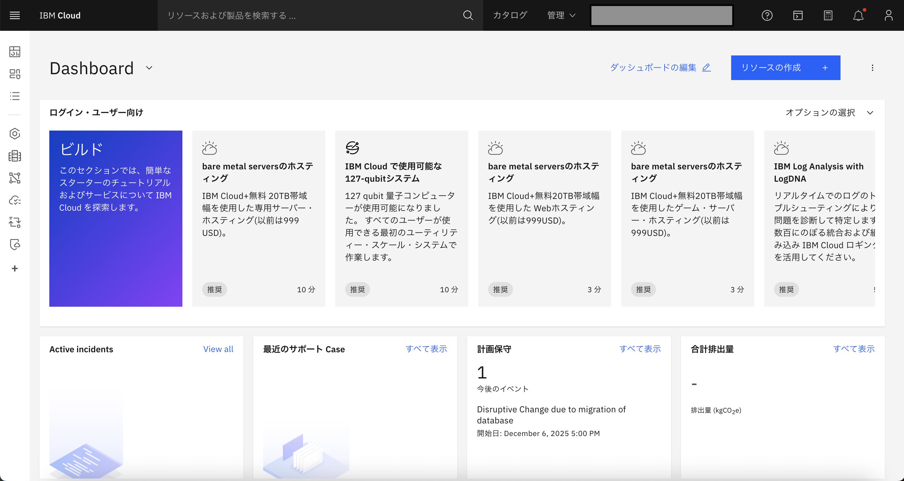

# ハンズオン実施
前提：
[ワークショップ環境へのアクセス](01_techzone_use_environments.md)が完了し、IBM CloudのダッシュボードがWebブラウザーに表示されていることが前提です。

  

# ハンズオン
以下の順序で各リンクにアクセスし、実施してください 
### 1. wastonx.dataへのアクセスと接続準備
watsonx.dataを立ち上げ、接続準備を行います。 
- [wastonx.dataへのアクセスと接続準備](02_01_watsonx_access.md)

### 2. 非構造化データのキューレーション（Unstructured data curation：UDC）
非構造化データキュレーション資産を作成します。 
- [非構造化データのキューレーション（Unstructured data curation：UDC）](02_02_UDC.md)
 
 
### 3. ドキュメントライブラリを使用してテストする
取り込んだドキュメントセットとチャットを実行します。
- [ドキュメントライブラリを使用してテストする](02_03_chat.md)

