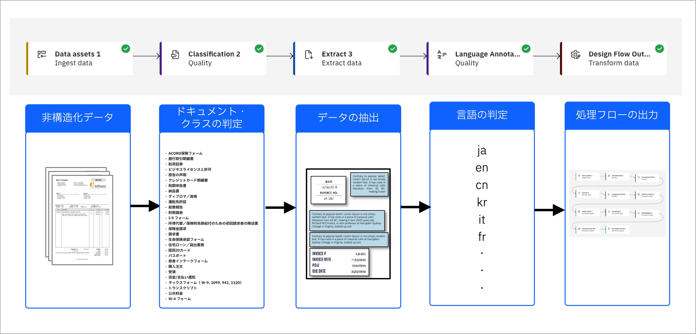
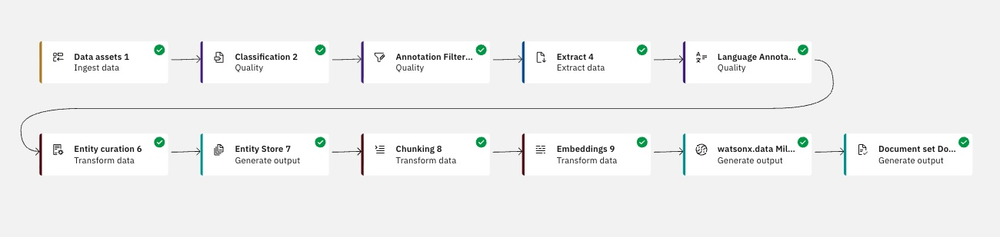
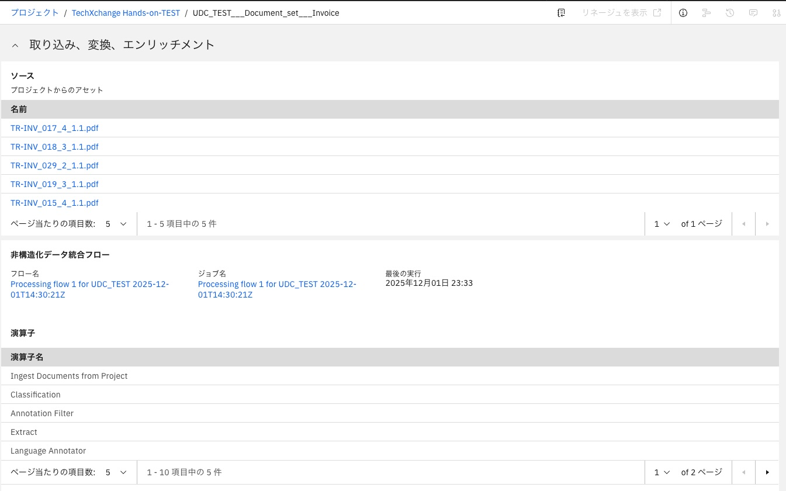
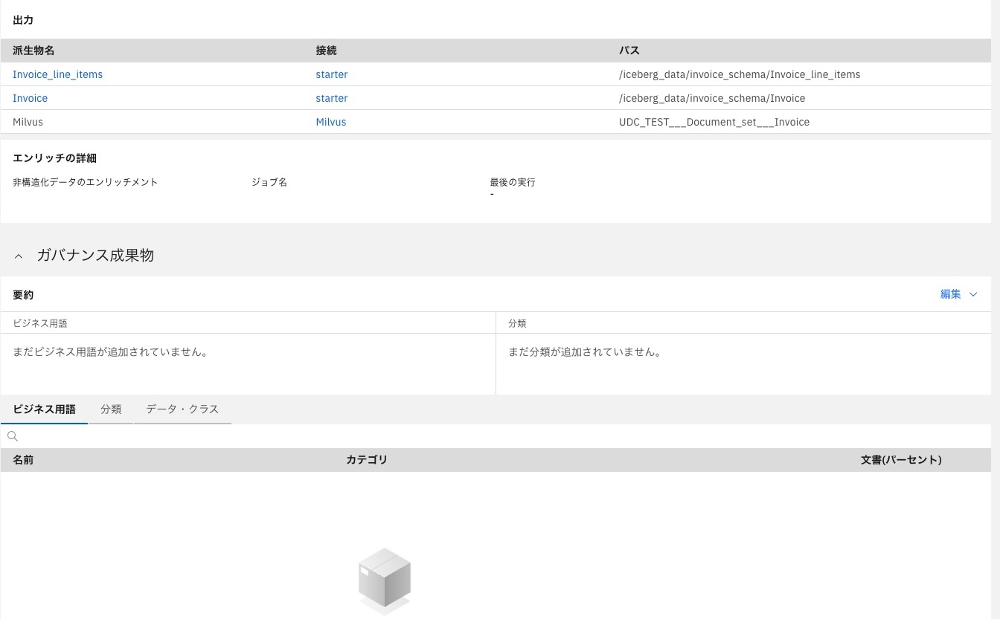
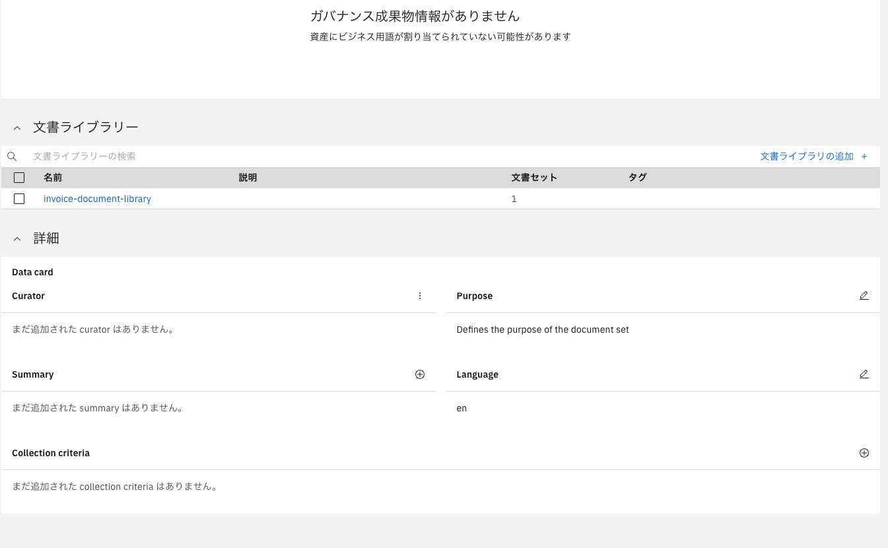
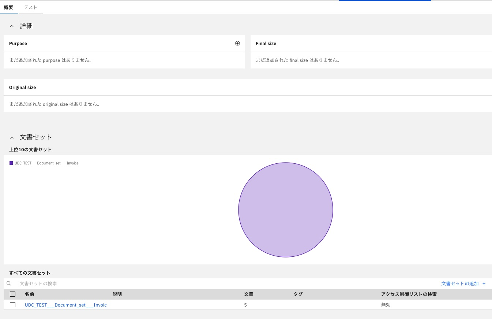

# watsonxハンズオン
# watsonx.dataでらくらく、非構造化データ取込&高精度RAGを実現
# このハンズオンについて
このハンズオンは11月下旬に公開された機能「非構造化データのキューレーション（Unstructured data curation: UDC）」を使用します。この機能はまず最初に非構造化データであるPDFファイルからデータを抜き出し、ドキュメント(文書)・クラスを特定し、ドキュメント処理のフローを自動で作成します。

 
&nbsp; 

作成されたフローは大まかに以下を行うようになっています。

- 指定された非構造化データからデータ抜き出す
- ドキュメントクラスの特定
- ドキュメントクラスを元にエンティティ抽出を行い、エンティティデータをIcebergテーブルに入れる、
- データをチャンキング後ベクトル化しMilvusに挿入する
- ドキュメント(文書)・セットを作成し、ソース、エンティティデータ、ベクトルデータの情報を記録する
- ドキュメント(文書)・ライブラリーに、作成したドキュメント・セットを追加

 
&nbsp; 

ドキュメント・セットは同じドキュメント・クラスを持った情報の集まりです。 
Invoice(請求書)のドキュメント・クラスの場合はInvoice(請求書)のドキュメント・セットが作成されます。 
このハンズオンではやりませんが、もしInvoice(請求書)とPurchase Order(注文書)のPDFが混ざっていれば、Purchase Order(注文書)のドキュメント・セットとInvoice(請求書)のドキュメント・セットが作成されます。

 
 
 

このドキュメント・セットを登録したものが、ドキュメント・ライブラリーです。 
ドキュメント・ライブラリーはRAGで検索する対象と考えてください。今回は1つのドキュメント・ライブラリーに1つのドキュメント・セットしか入れませんが、複数のドキュメント・セットをいれることが可能です。

ドキュメント・ライブラリーに対しては、その中身に関して自然言語で検索することが可能です。

 

今回のハンズオンは、「非構造化データのキューレーション（Unstructured data curation: UDC）」を使って英語のInvoice(請求書)のPDFファイルからデータを抽出するフローを作成し、フローを実行します。その後作成されたドキュメント・ライブラリーを使ってRAG構成のチャットをやってみます。

## 00. 事前準備

- [ワークショップ環境の事前準備](00_techzone_environments_preparation.md)

## 01. ワークショップ環境へのアクセス

- [ワークショップ環境へのアクセス](01_techzone_use_environments.md)

## 02. ハンズオン実施
- [ハンズオン実施](02_hands_on_guide.md)
