# インストラクター用　 watsonxの事前準備

当日ハンズオンをスムーズに進行させるために、watsonx の初期設定を事前に行います。<br>
既に[インストラクター用　watsonx.dataの事前準備](01_prep_watsonx.data.md)でIBM Cloudの画面を開いている場合は、「[3. watsonx画面の表示](#3-watsonx画面の表示)」に進んでください。


## 1. Instructor URLにアクセス
Techzoneの「My workshops」メニューから該当のWorkshopを開いてください。そこが Instructor URLです。
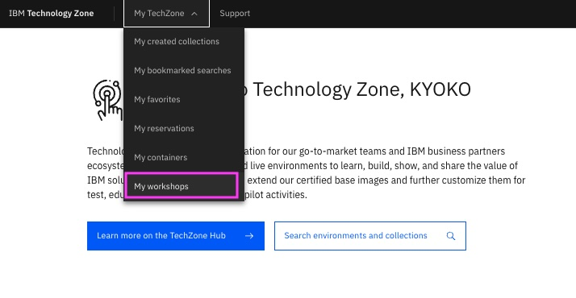<br>
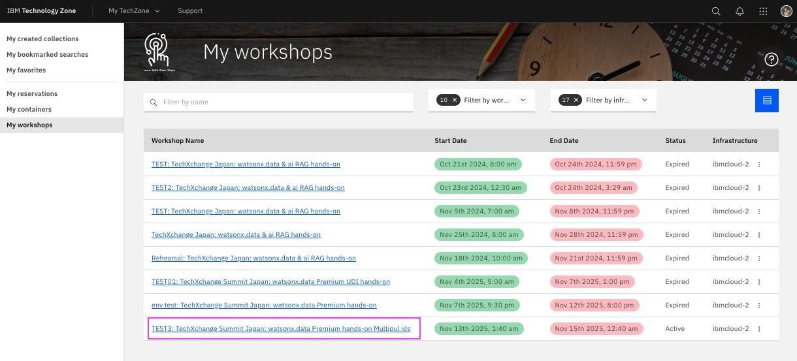<br>
<p>
または該当のWorkshopを開いて表示された「Instructor URL」となります(クリックすると同じ画面になります)
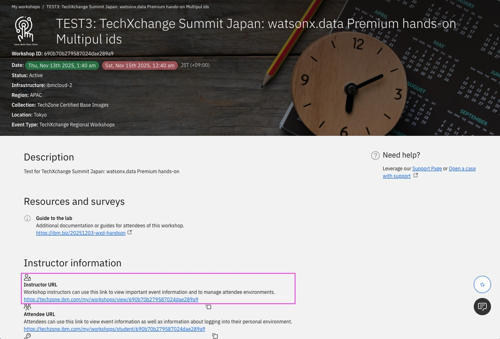<br>


## 2. 担当のIDのログインURL, Username, Passwordを使ってIBM Cloudにログイン
Environmentsセクションの　担当番号のセクションを開きます。<br>

### ログインURL
`App ID Instructions`の中に記載されているURLがログインURLです。上の方に表示されている`IBM Cloud Login URL`ではありませんのでご注意ください。<br>
なぜかマスキングされていた場合は目玉アイコンをクリックして表示させてください。<br>
以下のような文章が表示されいるので、この中に記載されている`https://` から始まるURLがログインURLとなります。
```
An IBM App ID Cloud Directory instance has been created for you as the default IDP. It may be accessed here https://cloud.ibm.com/authorize/12b123456c0b342e8b4d5f4c521fa5ba1/xxxxxxx and logged in using any of the following pre-generated user accounts and passwords:
```
`App ID Instructions`の中のURLをクリップボードにコピーして、WebブラウザーのURL入力フィールドにペーストしてログインURLにアクセスしてください。

### Username, Password
`App ID User Credentials`にあります。上の方に表示されている`IBM Cloud Username (your email)`および`IBM Cloud Password (user must provide their own)`ではありませんのでご注意ください。<br>
最初の`@techzone.ibm.com`で終わる文字列がUsername, スペースの後の2番目の文字列がPasswordです。<br>
ログインURLにアクセスして表示されたページのフォームにそれぞれコピーして入力してください。<br>
<br>


### ログインURLをブラウザーで開き,　Username, Passwordを使ってIBM Cloudにログインします。<br>
尚、自分のIBMIDでのIBM SSOログインと混ざらないように、シークレットウィンドウ(プライベートウィンドウ)を推奨します。
<br>
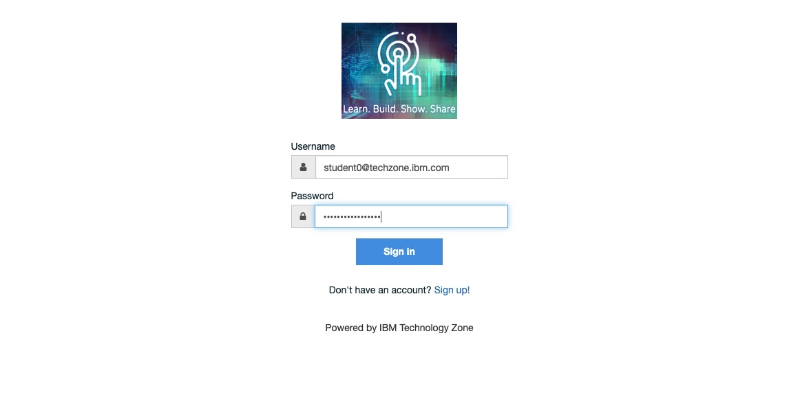<br>


## 3. watsonx画面の表示
既に[インストラクター用　watsonx.dataの事前準備](01_prep_watsonx.data.md)から継続している場合は、Webブラウザーのタブにwatsonx.dataではなく、**IBM Cloudの画面**が開いていることを確認してください。そうでない場合は**IBM Cloudの画面**が開いているタブを表示させてください。<br>
&nbsp;<br>

左上のナビゲーション・メニューをクリック後、メニューの下の方の「watsonx」をクリックし、watsonxの起動画面を開きます。<br>
<br>
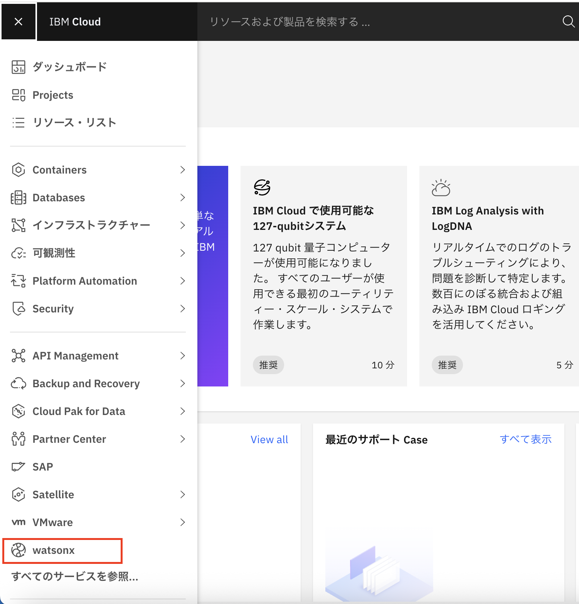<br>


## 4. watsonx の起動
watsonxの起動画面の、右側の「watsonx.data」の下にある「起動」ボタンをクリックします。<br>
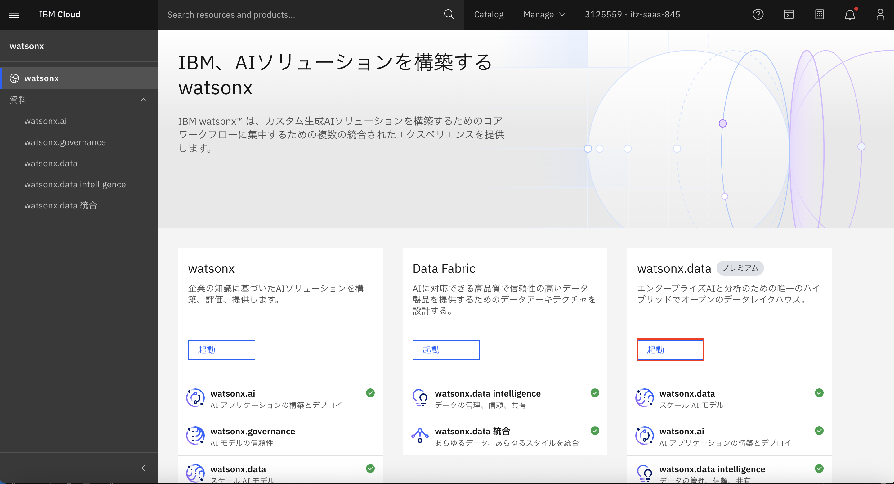<br>


## 5. watsonx のコンソールの表示
watsonx.aiのトップページが開きます。
「watsonxへようこそ」というウィンドウが表示された場合は,チェックボックスにチェックを入れ、右上の[X]をクリックして閉じてください。<br>
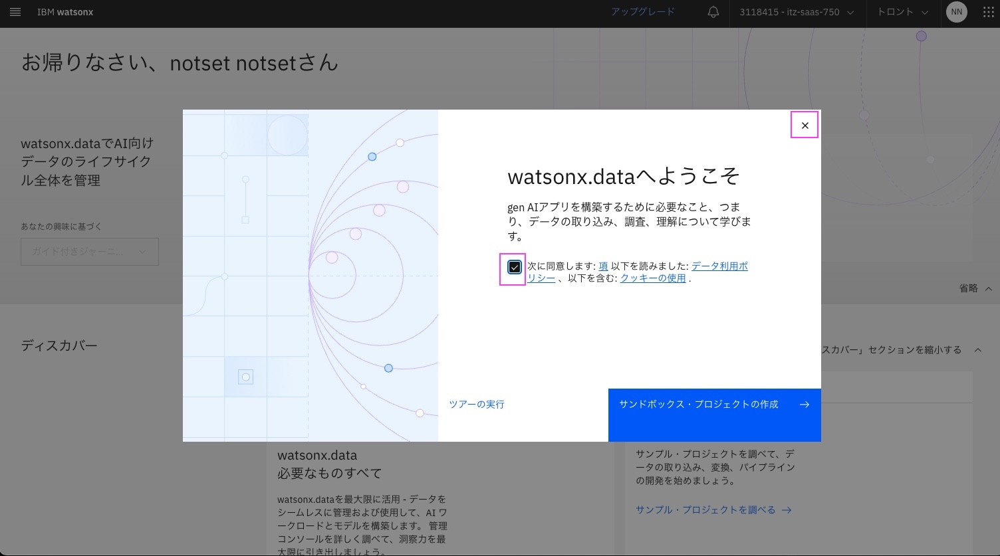<br>
&nbsp;<br>

## 6. IBM Watsonx User API Keyの作成
[インストラクター用　IBM Watsonx User API Keyの作成](03_prep_watsonx_user_apikey.md) を実施してください。


## 7. プラットフォーム接続の作成
左上のナビゲーションメニューをクリックし、「Data」の下の「Connectivity」をクリックします。
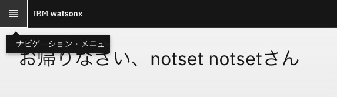<br>
&nbsp;<br>
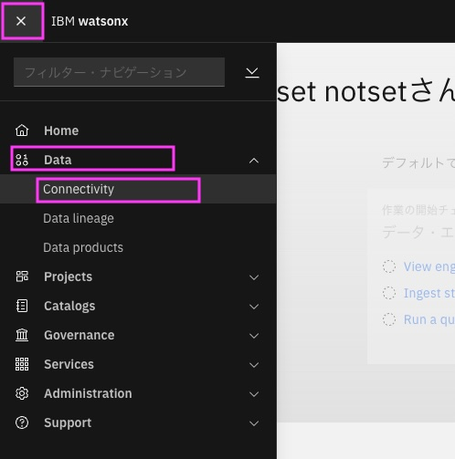<br>
&nbsp;<br>
「カタログの作成」をクリックします。
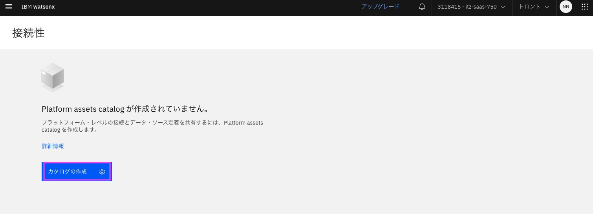<br>
&nbsp;<br>

そのまま「作成」をクリックします。
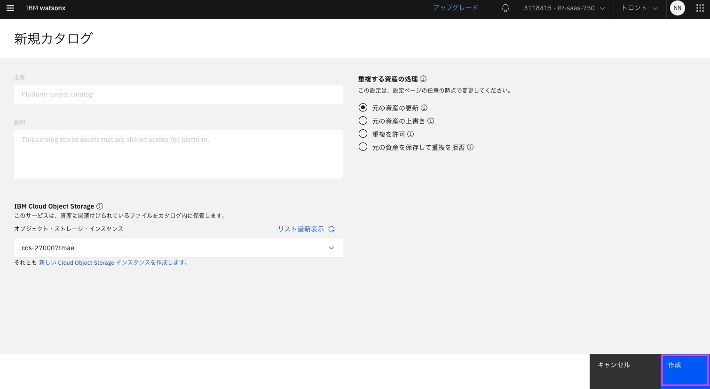<br>
&nbsp;<br>

しばらく待ちます:<br>
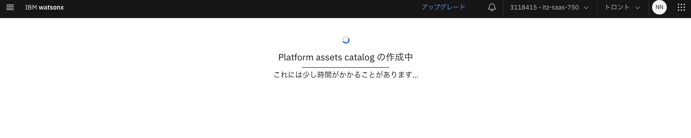<br>
&nbsp;<br>

作成完了すると以下の画面が表示されます。「プラットフォーム接続」をクリックします。
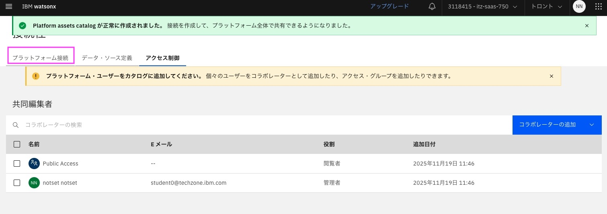<br>
&nbsp;<br>

### 7-1. Milvusエンジンへの接続作成
「新規接続」をクリックします
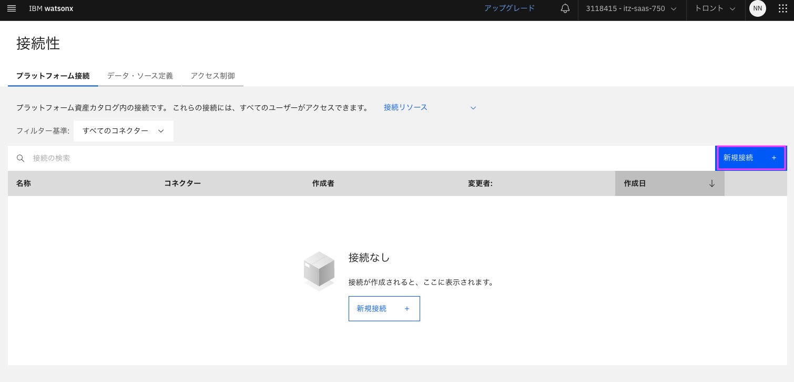<br>
&nbsp;<br>

左上の「コネクターの検索」に`watsonx`を入力し、表示された「IBM watsonx.data」をクリックします。<br>
IBM watsonx.data Milvusにチェックを入れ、「次へ」をクリックします。
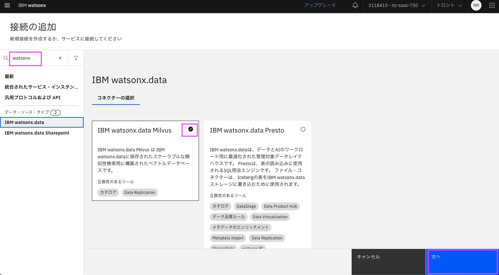<br>
&nbsp;<br>

watsonx.dataのweb画面からmilvusエンジンの接続情報のJSONスニペットをコピーします。<br>
[インストラクター用　 Milvusエンジンの接続情報のJSONスニペットをコピー](04_prep_watsonx_data_json_milvus.md) を実施してください。

#### Milvus JSONスニペットのコピー
コピーが完了したら、表示されている「接続の作成: IBM watsonx.data Milvus」の「JSONスニペットを入力」をクリックします。<br>
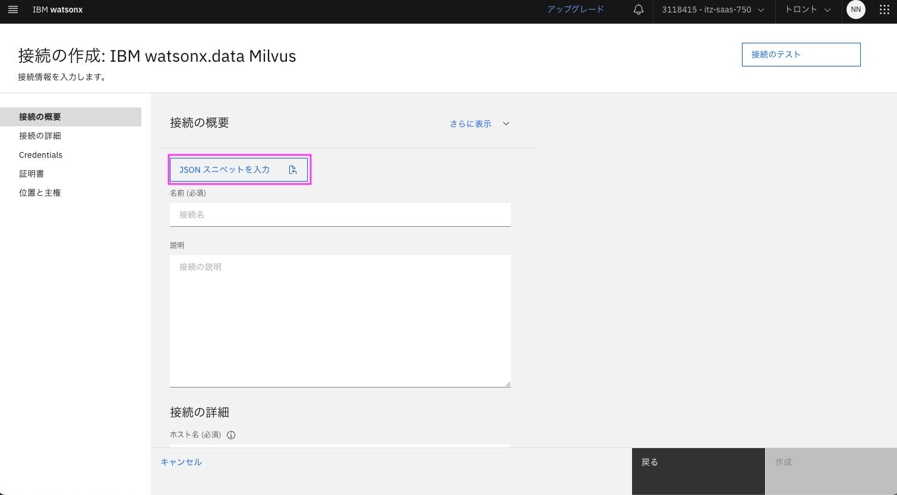<br>
&nbsp;<br>

JSONスニペットを入力」の画面で、「クリップボードから貼り付け」のラジオボタンをクリックし、入力欄にコピーしたJSONスニペットを貼り付けます。<br>
その後「Enter」をクリックします。<br>
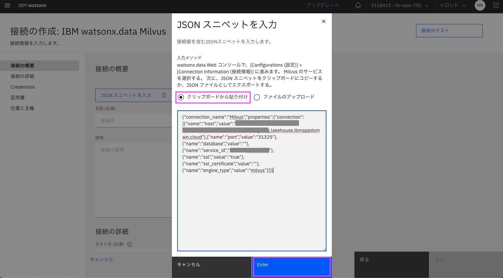<br>
&nbsp;<br>

#### ユーザー名とパスワードの入力
Credentialsの「ユーザー名(必須)」に`ibmlhapikey`を入力します。<br>
&nbsp;<br>
さらに最初にInstructor URLから開いた該当の番号の環境情報の<br>
`Service Id API Key for this environment`の値をコピーアイコンをクリックしてコピーして、、<br>
Credentialsの「パスワード(必須)」に貼り付けます。<br>
&nbsp;<br>
最後に右上の「接続テスト」をクリックします。
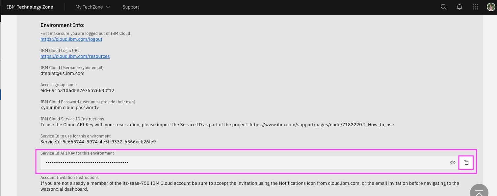<br>
&nbsp;<br>
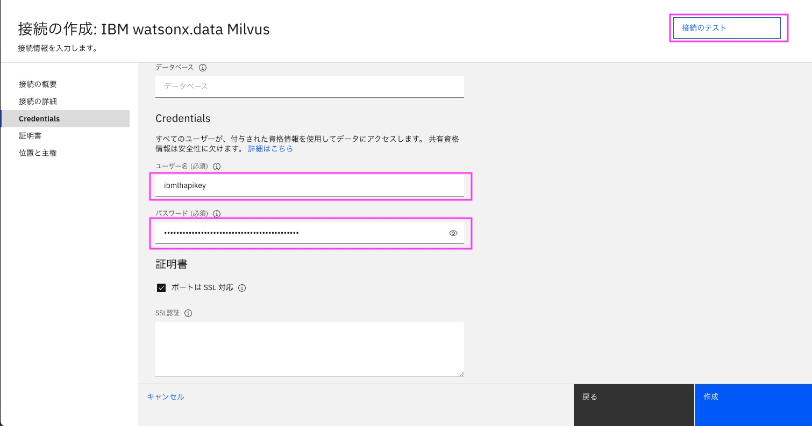<br>
&nbsp;<br>

「テストは正常に終了しました。」のメッセージを確認して、「作成」をクリックします。
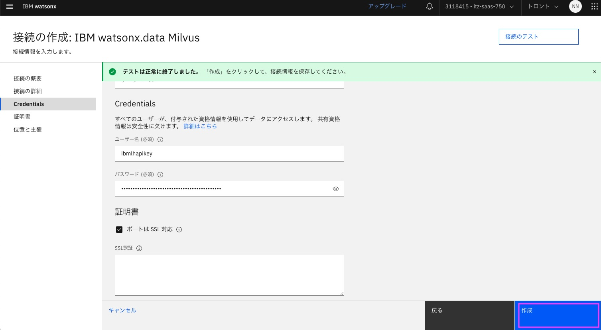<br>
&nbsp;<br>

### 7-2. starterエンジンへの接続作成
「新規接続」をクリックします
<br>
&nbsp;<br>

左上の「コネクターの検索」に`watsonx`を入力し、表示された「IBM watsonx.data」をクリックします。<br>
IBM watsonx.data Prestoにチェックを入れ、「次へ」をクリックします。
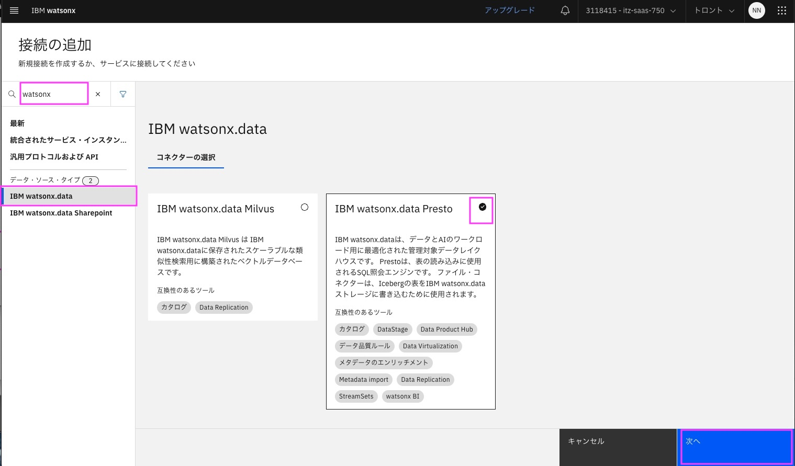<br>
&nbsp;<br>

watsonx.dataのweb画面からstarterエンジンの接続情報のJSONスニペットをコピーします。<br>
[インストラクター用　starterエンジンの接続情報のJSONスニペットをコピー](04_prep_watsonx_data_json_starter.md) を実施してください。

#### starter JSONスニペットのコピー
コピーが完了したら、表示されている「接続の作成: IBMwatsonx.data Presto」の「JSONスニペットを入力」をクリックします。<br>
<br>
&nbsp;<br>

JSONスニペットを入力」の画面で、「クリップボードから貼り付け」のラジオボタンをクリックし、入力欄にコピーしたJSONスニペットを貼り付けます。<br>
その後「Enter」をクリックします。<br>
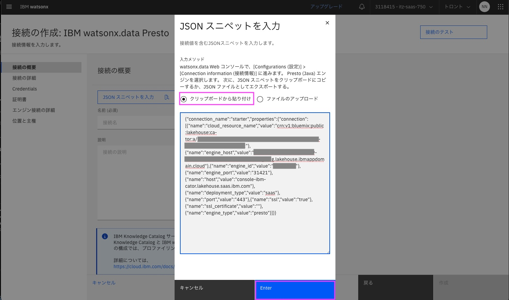<br>
&nbsp;<br>

#### APIキーの入力
さらに最初にInstructor URLから開いた該当の番号の環境情報の<br>
`Service Id API Key for this environment`の値をコピーアイコンをクリックしてコピーして、、<br>
Credentialsの「API キー(必須)」に貼り付けます。<br>
&nbsp;<br>
最後に右上の「接続テスト」をクリックします。
<br>
&nbsp;<br>
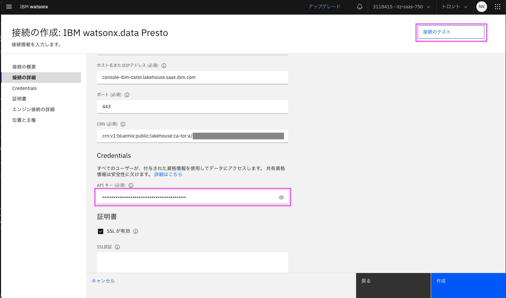<br>
&nbsp;<br>

「テストは正常に終了しました。」のメッセージを確認して、「作成」をクリックします。
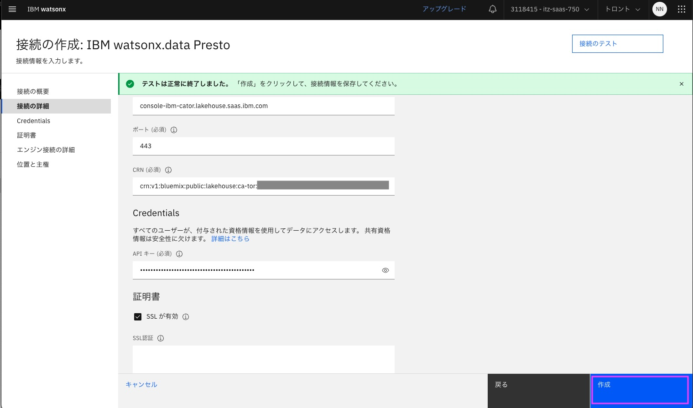<br>
&nbsp;<br>

左上の「IBM watsonx」のロゴをクリックして、watsonxのダッシュボードに戻ってください。
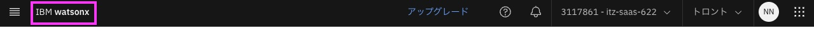<br>
&nbsp;<br>

## 8. サンプル・プロジェクトの作成
サンプル・プロジェクトを作成します。<br>
「ディスカバー」エリアに表示されている「まずは watsonx.data」　というタイルにある「サンプル・プロジェクトの作成」ボタンをクリックします。
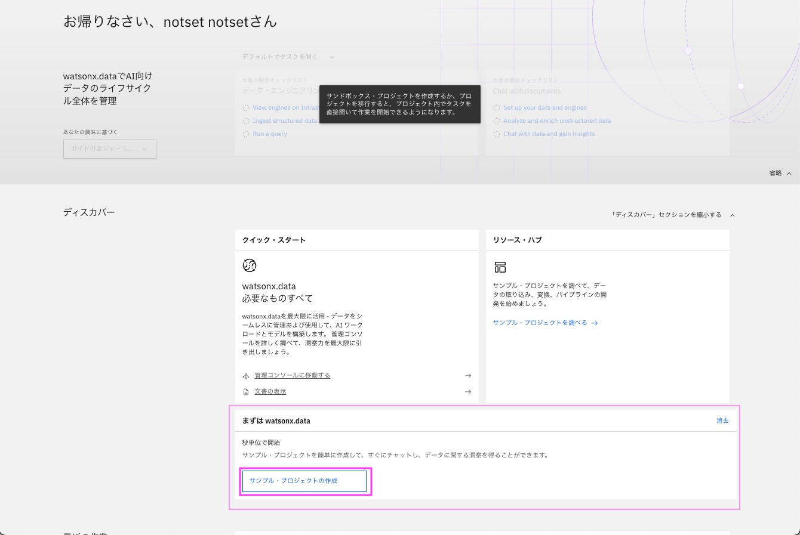<br>
&nbsp;<br>

### 8-1. 名前を`TechXchange Hands-on`に変更します
「Getting started with watsonx.data gen AI capabilities」という名前から<br>
`TechXchange Hands-on`<br>
いう名前に変更してください。

### 8-2. ストレージ・サービスの選択
①ストレージ・サービスの選択<br>
ターゲット Cloud Object Storage インスタンス<br>
`cos-`で始まるCloud Object Storage インスタンスをセットしてください。<br>
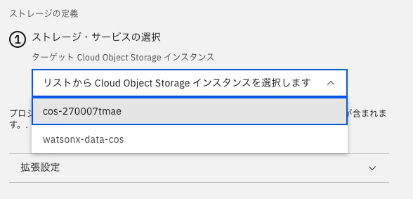<br>
&nbsp;<br>

### 8-3. サービス・インスタンスの定義
watsonx.ai Runtimeに1つだけサービスインスタンスが入っているので、それをセットしてください。<br>
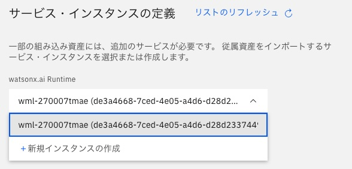<br>
&nbsp;<br>

### 8-4. 「作成」のクリック
上記3つをセットしたら、「作成」をクリックしてください。
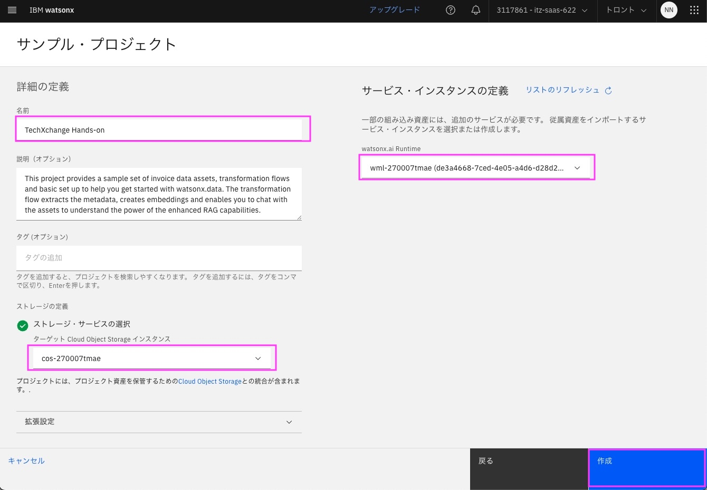<br>
&nbsp;<br>

作成中の画面が表示されるので作成完了まで待ちます。<br>
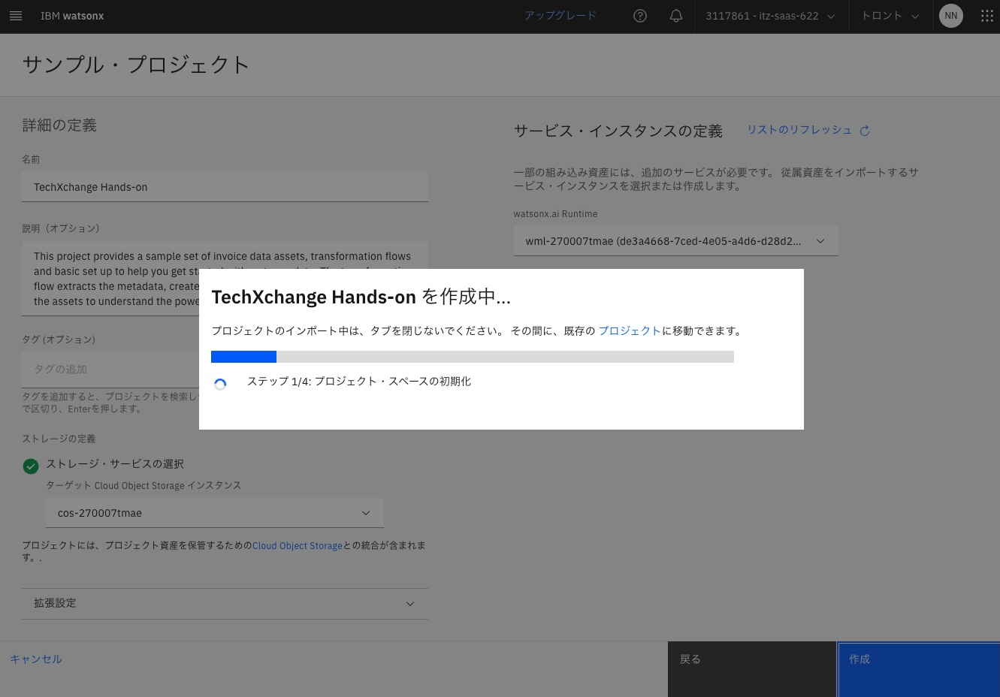<br>
&nbsp;<br>

下記の画面が表示されれば完了です。「新規プロジェクトの表示」をクリックしてプロジェクトが表示できることを確認します。<br>
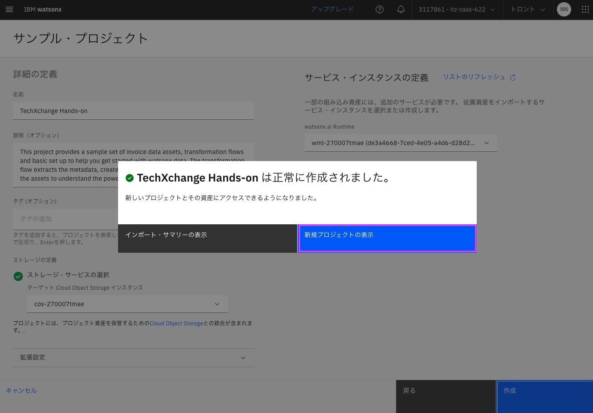<br>
&nbsp;<br>

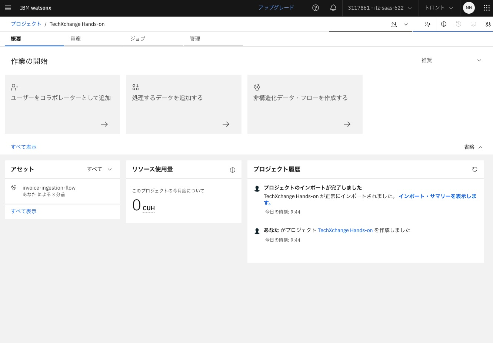<br>
&nbsp;<br>


### 8-5. 「非構造化データ統合フロー」の削除
「資産」タブをクリックし、非構造化データ統合フロー「invoice-ingestion-flow」の右のハンバーガーメニューから「削除」クリックしてください。<br>
その後、確認のウィンドウで「削除」をクリックします。<br>
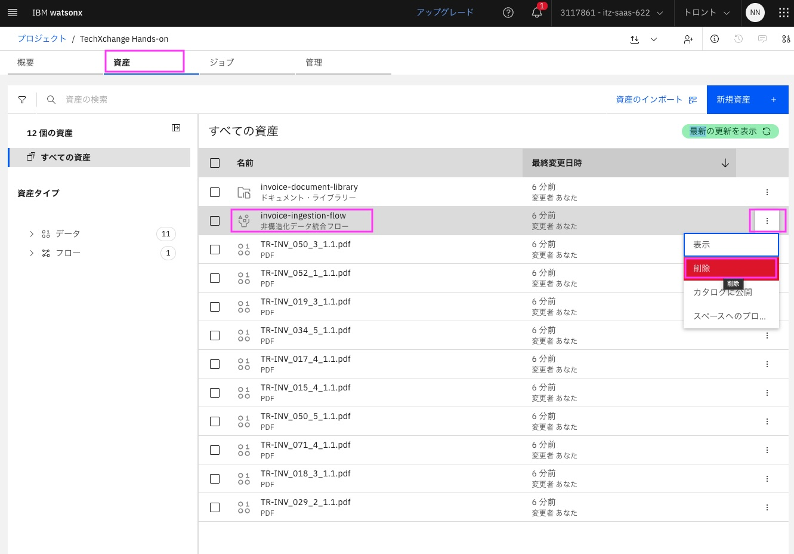<br>
&nbsp;<br>
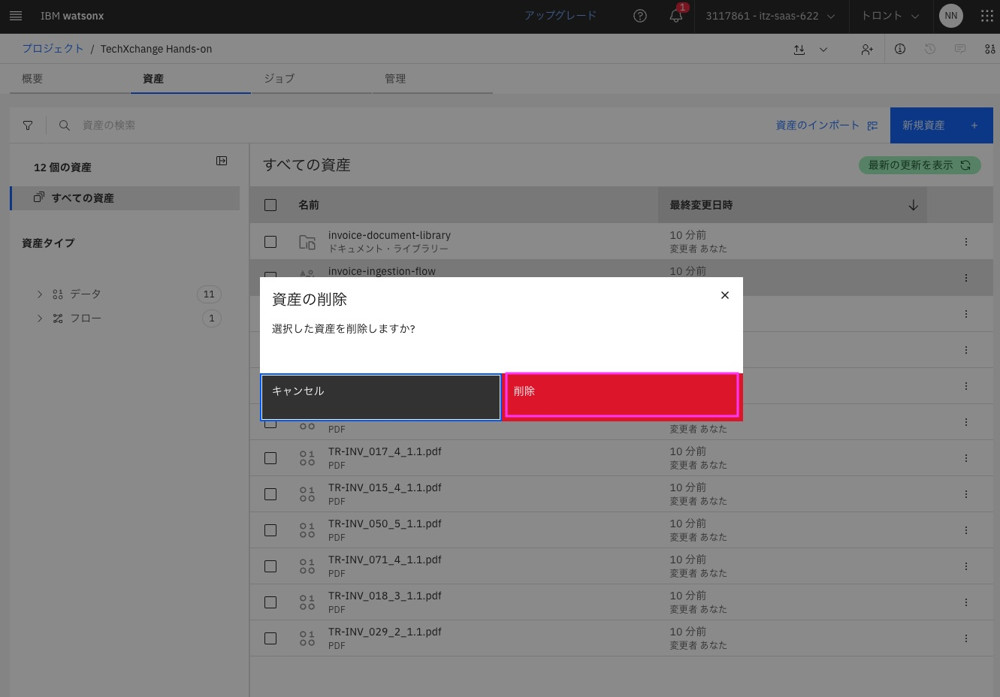<br>
&nbsp;<br>

削除が完了したら左上の「IBM watsonx」のロゴをクリックして、watsonxのダッシュボードに戻ってください。<br>
<br>
&nbsp;<br>


watsonx の設定はこれで完了です。<br>
別にUsernameの設定をする場合はwatsonx、watson.data, IBM Cloudコンソール、全てログアウトしてから実行してください。


