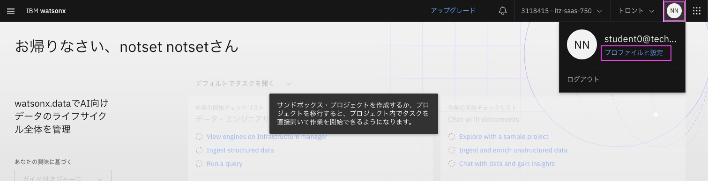
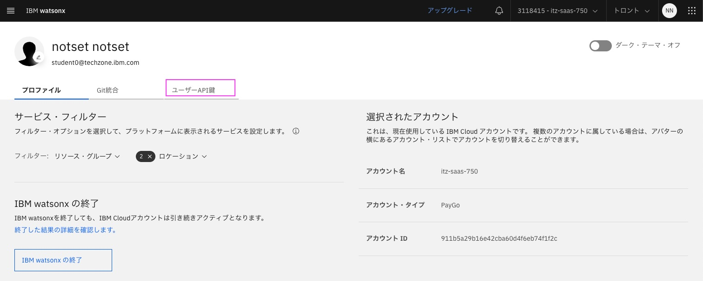
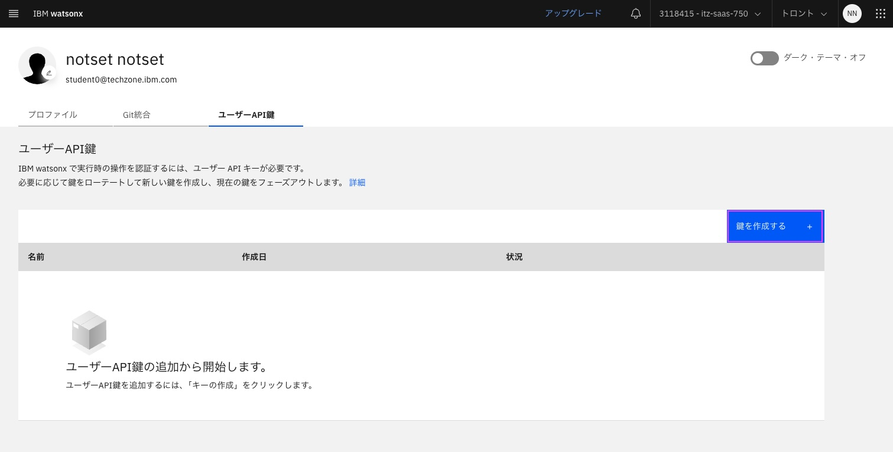
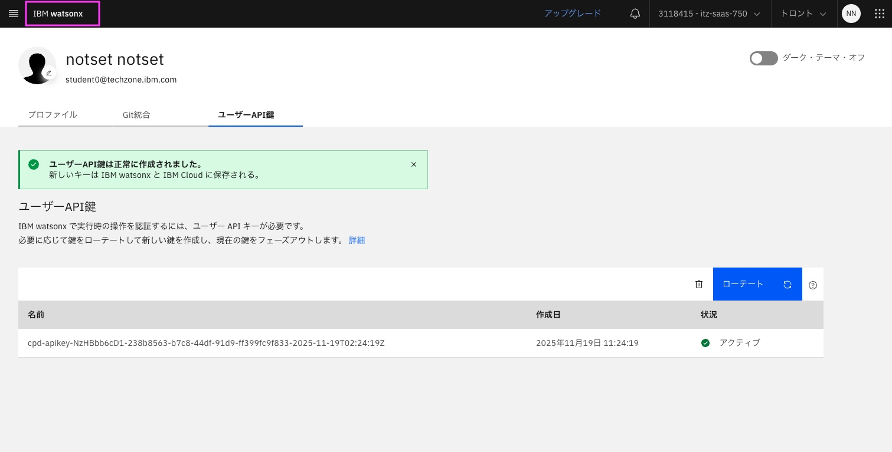
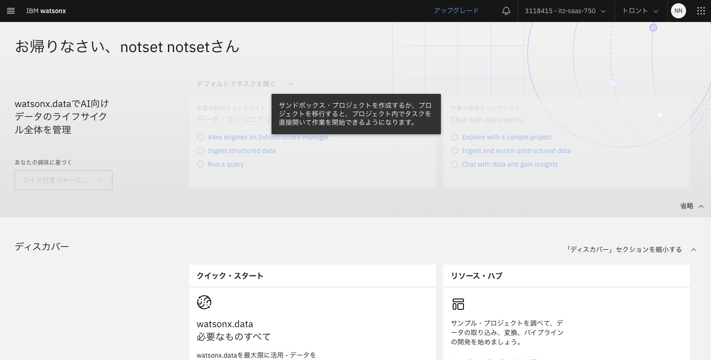

# インストラクター用　IBM Watsonx User API Keyの作成

[インストラクター用　watsonx.data integrationの事前準備](02_prep_watsonx.data_premium.md) の「5. watsonx.data integrationのコンソールの表示」まで実施している前提です。

ユーザー用にユーザーAPIキーが生成されていることを確認します。ない場合は作成します。 
IBM Watsonxでのランタイム操作を認証するには、ユーザーAPIキーが必要です。

## 1. 「プロファイルと設定」画面の表示
watsonx.data integration コンソールで、右上の丸いプロフィール・アイコンをクリックします。 
次に、「プロファイルと設定」をクリックします。 
 
&nbsp; 

## 2. 「ユーザーAPI鍵」画面の表示
表示されたプロファイル画面で、「ユーザーAPI鍵」タブをクリックします。 
 
&nbsp; 

## 3. 「ユーザーAPI鍵」 の作成
表示された「ユーザーAPI鍵」の画面にキーが一つもない場合は、作成します。 
既に1つ作成済みであれば、作成不要です。4に進んで戻ってください。 
&nbsp; 
「鍵を作成する」をクリックして作成してください。 
 
&nbsp; 

しばらく待つと、作成された鍵が表示されます。 
 
&nbsp; 

### 4. watsonx.data integrationのコンソールを表示します
左上部の「IBM watsonx」をクリックして元の画面に戻ります。 
 
&nbsp; 
 
&nbsp; 

[インストラクター用　watsonx.data integrationの事前準備](02_prep_watsonx.data_premium.md) の「7. プラットフォーム接続の作成」に戻ってください。