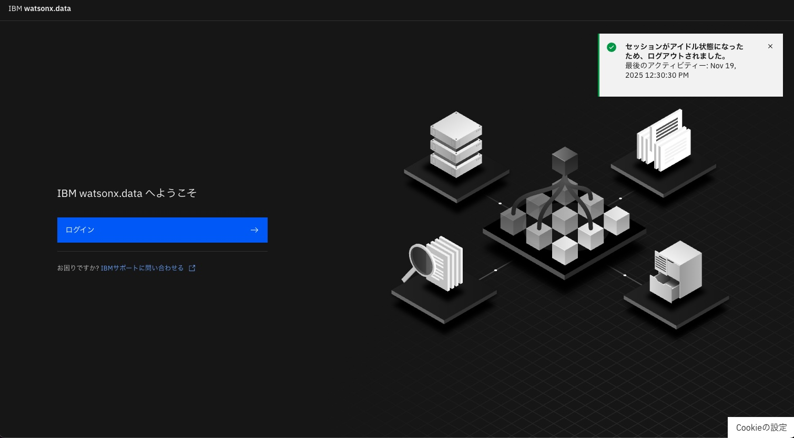
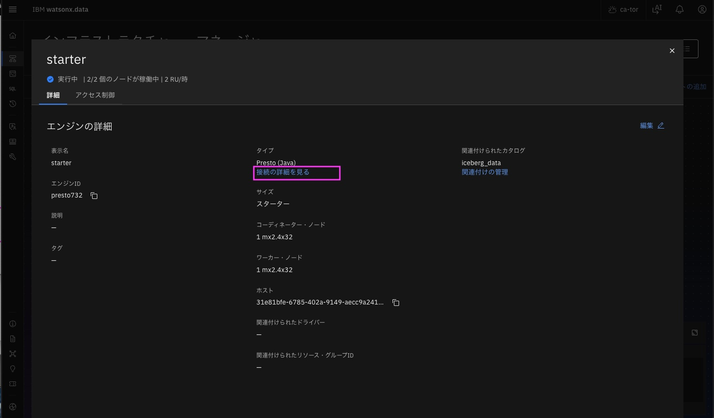
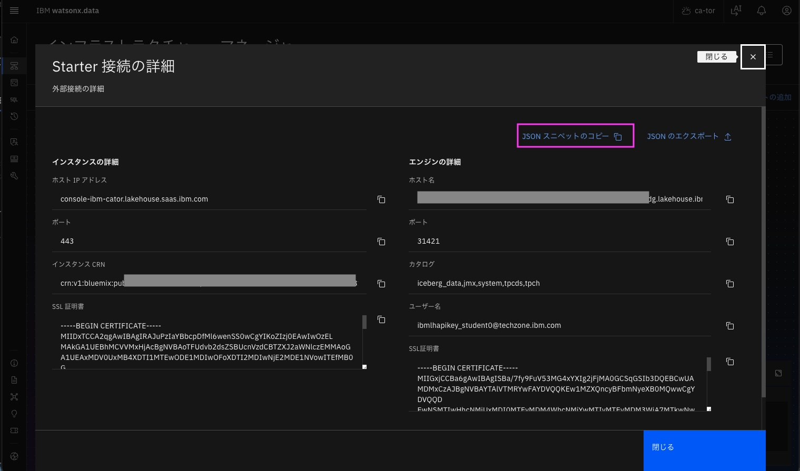
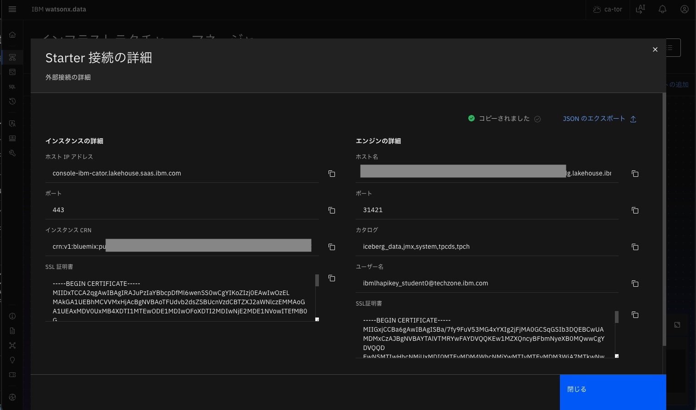
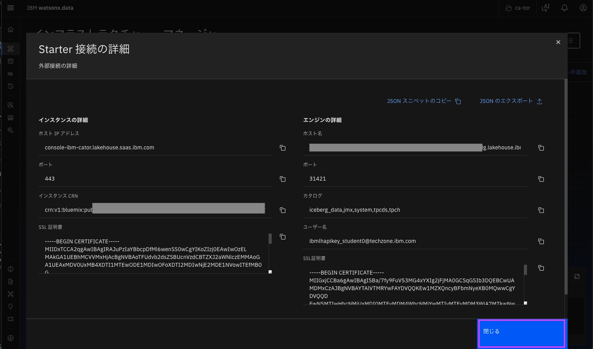
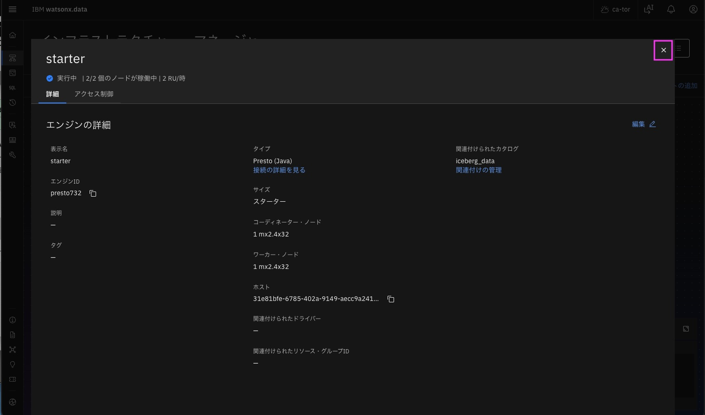

# インストラクター用　 starterエンジンの接続情報のJSONスニペットをコピー

以前開いていたwatsonx.dataのブラウザー画面を開いてください。 
既にログアウトしていた場合は、ログインをクリックして、ログインしてください。 
 
&nbsp; 

 ### 1. インフラストラクチャー・マネージャーを開く
 左上のグローバル・ナビゲーションをクリック後、「インフラストラクチャー・マネージャー」をクリックし、インフラストラクチャー・マネージャーを開きます。 
 
&nbsp; 
 
&nbsp; 

 
&nbsp; 

### 2. starterエンジンの接続情報のJSONスニペットをコピー
「starter」アイコンをクリックします。サービスの詳細が表示されます。 
「接続の詳細を見る」をクリックします。 
 
&nbsp; 

「JSONスニペットのコピー」をクリックします。 
 
&nbsp; 

「コピーされました」と一瞬だけ表示されます。 
 
&nbsp; 

「閉じる」をクリックします。 
 
&nbsp; 

右上の「x」をクリックします。 
 
&nbsp; 

これでstaterエンジンの接続情報のJSONスニペットがクリップボードにコピーできました。

 watsonxのブラウザー画面に戻ります。

[7-2. starterエンジンへの接続作成 「 starter JSONスニペットのコピー」](02_prep_watsonx.data_premium.md#starter-jsonスニペットのコピー)手順に戻ってください