# Lab1 Hello world

このLabでは、watsonx Orchestrateにログインし、カスタム・スキルを追加します。

## watsonx Orchestrateの画面を確認してみよう
このセクションでは、watsonx Orchestrateの主な画面構成について学びます。

 1. watsonx Orchestrateにログインします。
 2. IBM-idを入力して、**Continue** ボタンをクリックします。
 3. 複数テナントに所属する場合には、テナント選択画面が表示されるので、適切なテナント名を選択してください。  
　
　

 4. 以下のような画面が表示されます。（ツアーのダイアログが表示された場合にはスキップしてください。）  
　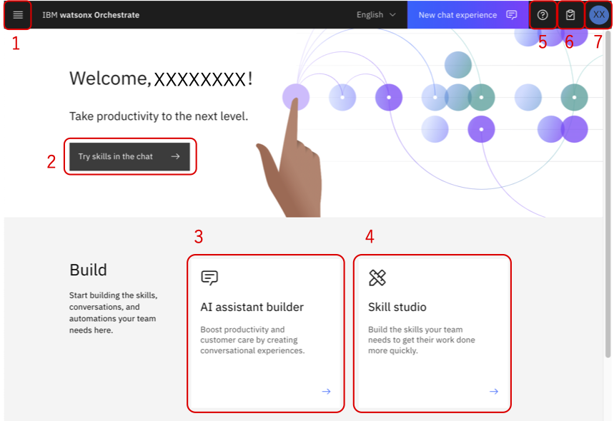

 5. 詳細は以下の通りです。

    1.メニュー  
    各画面へ遷移するためのメニューが表示されます。    

    2.チャット画面  
    watsonx Orchestrateへ様々な処理を依頼するためのチャット画面    

    3.AI assistant builder 
    外部のWebサイトなどに組みこんだり、Slackなどのチャネルと統合可能なAIアシスタントの構成が可能です。  

    4.Skill studio 
    スキルの追加やスキルフローの作成、意思決定、ワークフロー、生成AIに関する処理をローコードで実装し、スキル(Automations)として公開が可能です。  

    5.ヘルプ  
    各種ヘルプへのリンクが表示されます。複数アカウントに所属する場合には、Swtich Accountからアカウントの切り替えが可能です。  

    6.タスク・リスト  
    ワークフローを使用している場合に、自分に割り当てられたタスクが表示されます。  
    
    7.プロファイル/設定  
    ユーザーのプロファイル設定が可能です。

6. テナントIDを取得するには、右上のイニシャルが表示されているアイコンをクリックし、Aboutを選択します。  
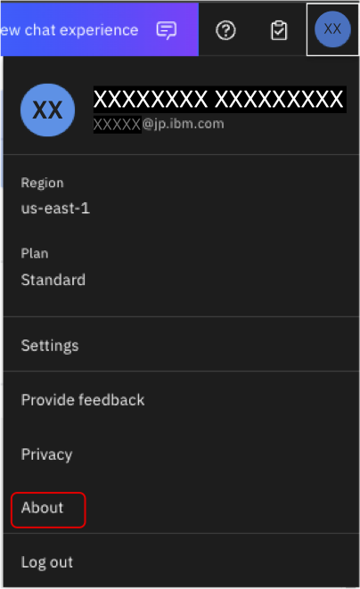

7. 以下のようなダイアログが表示されます。crnからはじまる文字列がIDです。サポートに問い合わせる際にはこのIDを伝える必要があるため、覚えておきましょう。  
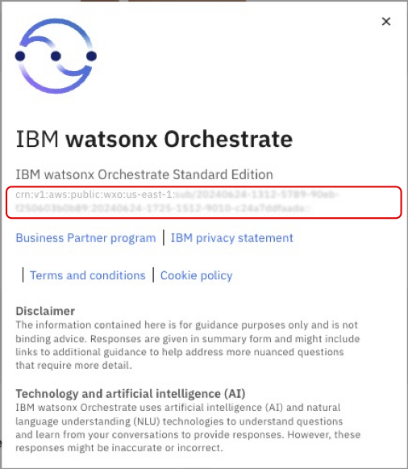

## スキルの追加
watsonx Orchestrateには、プリビルド・スキルと呼ばれる1000以上の様々なスキルが付属し、すぐに使用することが可能ですが、以下の方法でスキルを追加することも可能です。：

- Open APIの定義ファイル(json/yaml)をインポートする。
- 既存スキル(ワークフローやRPA)のディスカバリー
- スキルフローの作成
- Automation Builderによるスキルの実装

このLabでは、OpenAPI定義をインポートしてスキルをカタログに追加する方法について学びます。では、始めましょう！

1. まず[こちらのリンク](https://n28bf9mpmg.execute-api.us-west-2.amazonaws.com/default/hellowatonx)をクリックして、Hello world OpenAPIが利用可能であることを確認してください。 {"message":"Missing Authentication Token"}と表示されればOKです。このAPIはAWS上で動作するシンプルなAPIです。

2. [こちらのリンク](./files/helloworld-watsonx.yaml)を右クリックしてファイルに保存してください。このファイルは先ほどのAPIの定義情報です。

3. notepad, VSCode, vi/vimといったお好みのエディタでファイルを開き編集します。
```
openapi: 3.0.3
info:
  title: YourInitials-helloworld-watsonx
  description: Hello world WatsonX
  version: 1.0.0
  x-ibm-annotations: true
  x-ibm-application-name: IBM Watsonx - Training
  x-ibm-application-id: watsonxai-YourInitials-training
  x-ibm-skill-type: imported
  x-ibm-application-icon: <svg version="1.1" id="Layer_1" xmlns="http://www.w3.org/2000/svg" xmlns:xlink="http://www.w3.org/1999/xlink" x="0px" y="0px" 
servers:
  - url: https://n28bf9mpmg.execute-api.us-west-2.amazonaws.com/default
security:
  - passwordGrant: [ ]
paths:
  /hellowatsonx:
    post:
      summary: YourInitials Hello World WatsonX
      operationId: Hello-YourInitials-watsonx
```
4. インポート時に他のハンズオン実施者とスキルが重複しないように、ファイルの中の、x-ibm-application-id, title,summaryとoperationIdをユニークにする必要があります。これらの値のYourInitialsの部分をあなたのイニシャルに置き換えてファイルを保存してください。更新後のファイルは以下のようになるはずです。(イニシャルの置き換え箇所は、4か所あります。)
```
openapi: 3.0.3
info:
  title: XX-helloworld-watsonx
  description: Hello world WatsonX
  version: 1.0.0
  x-ibm-annotations: true
  x-ibm-application-name: IBM Watsonx - Training
  x-ibm-application-id: watsonxai-XX-training
  x-ibm-skill-type: imported
  x-ibm-application-icon: <svg version="1.1" id="Layer_1" xmlns="http://www.w3.org/2000/svg" xmlns:xlink="http://www.w3.org/1999/xlink" x="0px" y="0px" 
servers:
  - url: https://n28bf9mpmg.execute-api.us-west-2.amazonaws.com/default
security:
  - passwordGrant: [ ]
paths:
  /hellowatsonx:
    post:
      summary: XX Hello World WatsonX
      operationId: Hello-XX-watsonx
```

5. メニューからSkill studio を選択します。  
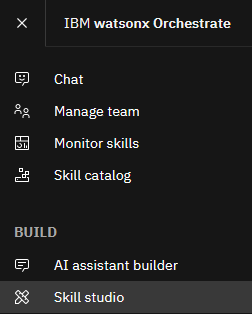

6. 右上にあるCreateボタンをクリック、Import APIをクリックします。  


7. From a fileを選択してください。  
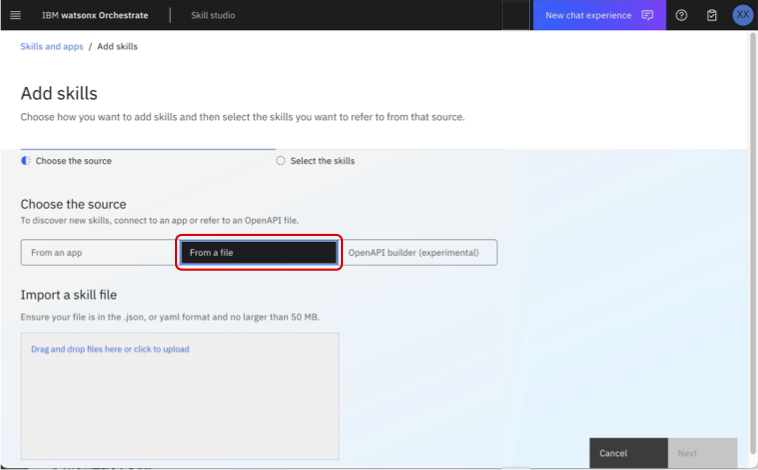

8. 先ほど保存したファイルをドラッグ＆ドロップするか、クリックして選択してください。
9. ファイルの検証が実施され、問題無ければ以下の様に表示されます。  
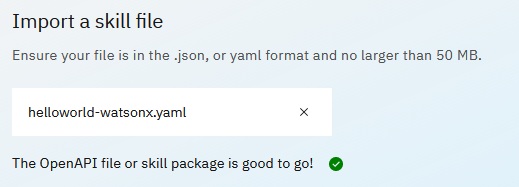

10. 右下のNextをクリックしてください。追加するAPIの内容が表示されます。
11. Hello World WatsonXのチェックボックスをチェックし、右下のAddボタンをクリックしてください。  
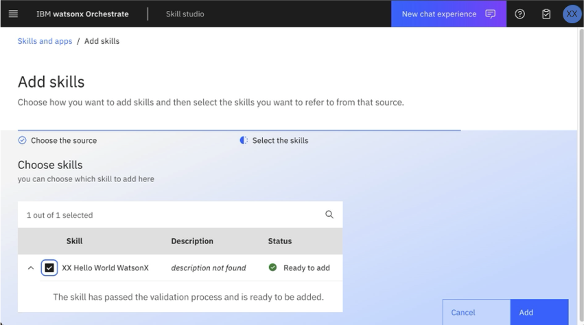

12. スキル一覧にインポートしたスキルが表示されるので、右側のメニューを展開し、**Enhance this skill**を選択してください。  
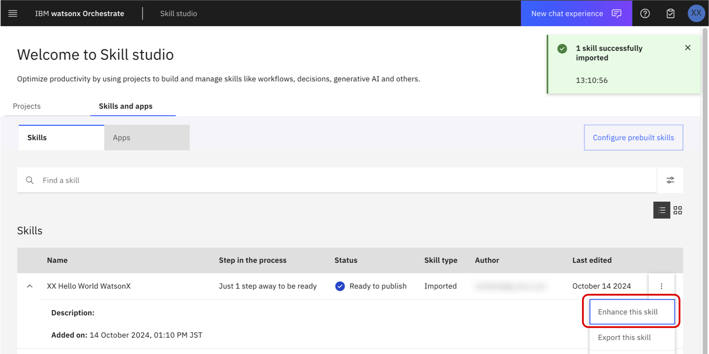

13. スキルの詳細が表示されます。スキルのEnhance画面から、スキルの入出力の表示、スキルを呼び出すためのフレーズ、watsonx Orchestrateが次に実行するスキルの提案を行うNext Best Skillsの設定などを行うことが可能です。  
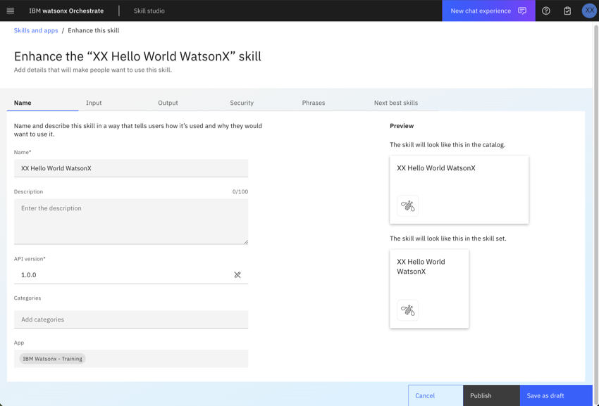

14. **Input**タブをクリックしてください。Inputタブでは、スキルの入力について確認することができます。スキルの入力パラメータに**name**があり、必須のパラメータで無いことが分かります。  
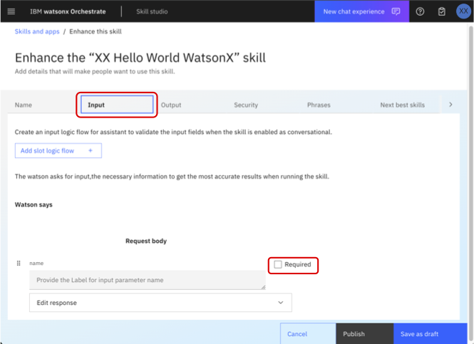

15. **Output**タブをクリックしてください。Outputタブでは、スキルの出力について確認することが可能です。スキルの出力パラメータとして**greeting**が定義されていることが分かります。  
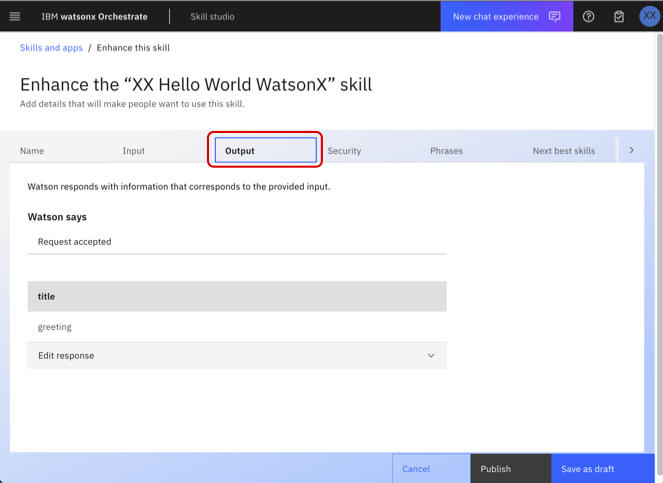

16. **Security**タブをクリックしてください。Securityタブでは、認証情報や、URLを確認することができます。また、接続のテストを行うことができます。  
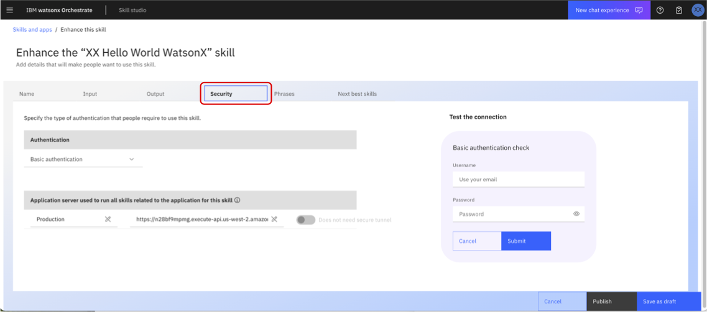

17. 接続のテストを実行してみましょう。Usernameに test@acme.com、Passwordにtestを入力します。今回使用するAPIについては認証不要のため、どんな値を入力しても問題ありません。

18. Submitボタンをクリックし、Authentication Successfulと表示されることを確認します。  
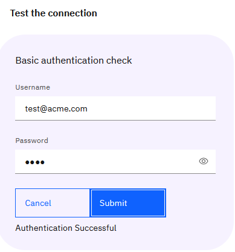

19. **Phrases**タブをクリックしてください。Phrasesタブでは、スキルを呼び出す際に使用するフレーズを登録します。ユーザーがここに登録した例文にマッチした文章をチャットから入力することでこのスキルが呼び出されます。複数のスキルがマッチした場合にはwatsonx Orchestrateは実行するスキルを確認してきます。既にフレーズが登録済みのはずですが、いくつかのフレーズを追加してみてください。また、入力フィールドにカーソルを移動させると表示される、**Auto-generate phrases**ボタンをクリックすることで生成AIを用いてフレーズのサンプルを自動生成することも可能です。  
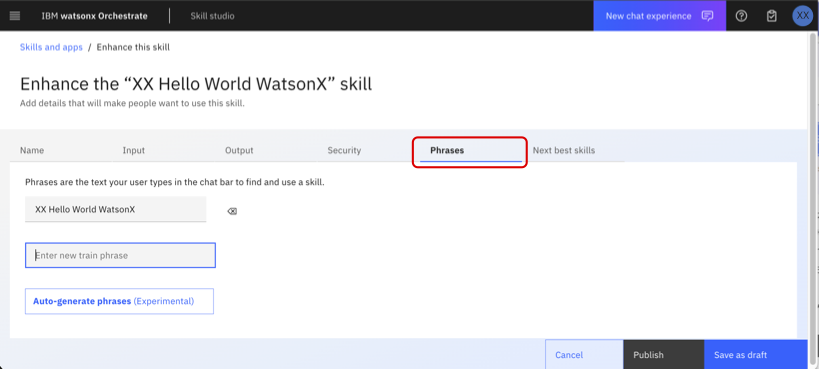

20. **Next best skills**タブをクリックしてください。このタブでは、スキルを実行した後に次に実行すべきスキルの選択肢として表示される複数のスキルを定義することが可能です。

    * Next best skillsは10個まで登録することが可能です。
    * Next best skillsに追加した各スキルに対して明示的に変数のマッピングを行うことが可能です。  

21. **Publish**ボタンをクリックして、スキルをPublishしてください。  
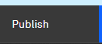


## Personal Skillへのスキルの追加
ここまでの作業で、カタログにスキルを追加することができました。次のステップとしてPersonal Skillにカタログからスキルを追加します。

1. 左上のメニューから**Chat**を選択してチャット画面を表示します。  
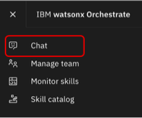

2. 以下のような画面が表示されるはずです。左下のAdd skills from the catalogをクリックします。  
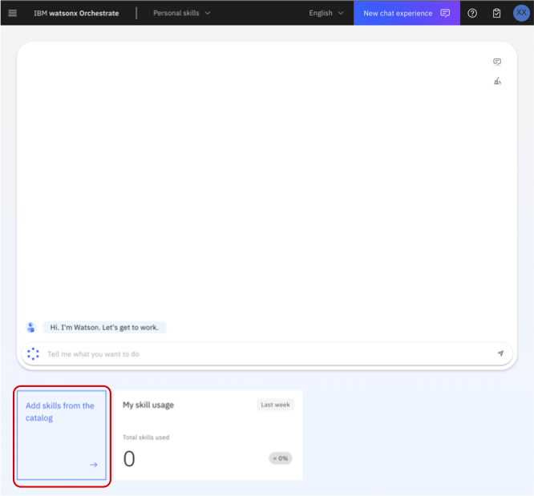

3. 検索フォームに先ほど作成したスキルの名前(hello world)を入力して検索を実行してください。表示されたAppsをクリックします。
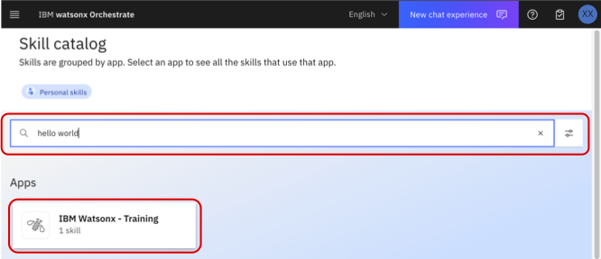

4. スキルを選択して、add skillをクリックしてスキルを追加します。  
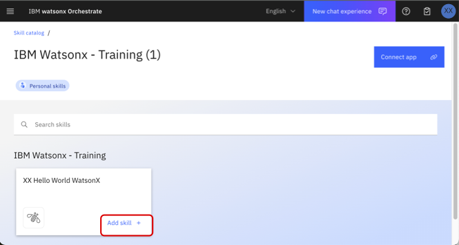

5. 右上の**Connect app**をクリックしてアプリケーションと接続します。
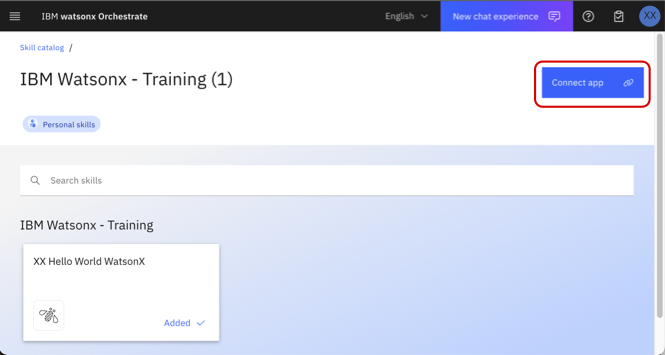

6. username,passwordに任意の値を入力し、Connect appボタンをクリックします。  
今回は、username は**test@acme.com**、passwordは**test**となります。
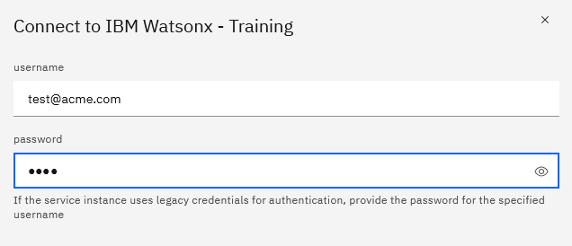

7. アプリケーションとの接続が完了しました！なお、接続はカタログからではなく、チャットからスキルを呼び出した際に実行することも可能です。  
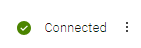

8. メニューからチャット画面に戻ります。スキルが追加されていることが分かります。  
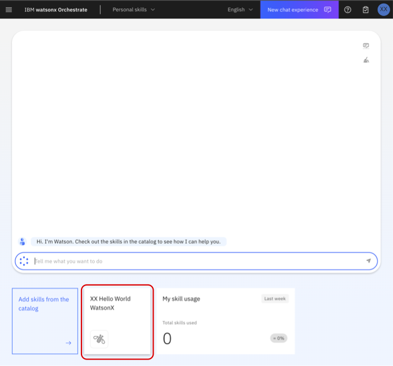

## スキルの動作確認
カタログから追加したスキルは以下の2つの方法で実行可能です:  
- チャット画面下部に表示されているスキルをクリックする  
- スキルをEnhanceした際に指定したフレーズ(watsonx Orchestrateが指定されたフレーズを元に学習するため、完全一致する必要はありません)を入力する

1. チャットの入力欄に、**Hello World WatsonX**と入力してみてください。  
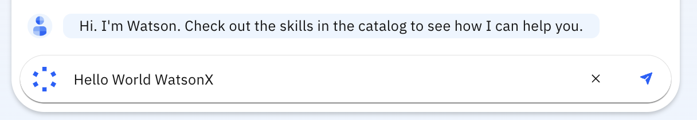

2. 先ほど追加したスキルが呼び出され、入力フォームが表示されます。  
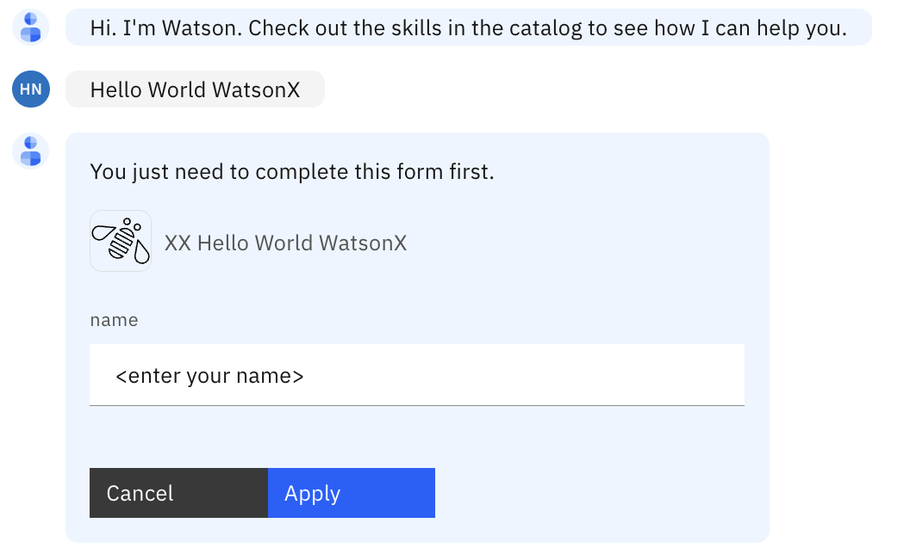

3. 自分の名前を入力し、**Apply**ボタンをクリックしてください。 
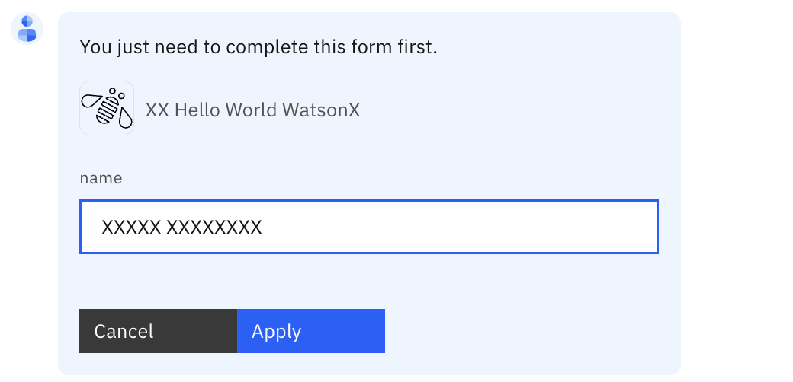


4. 結果が表示されるはずです。
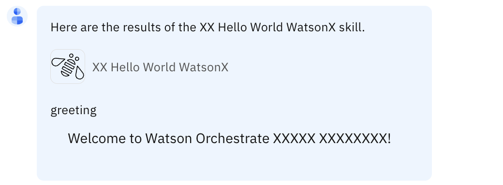

4. チャットの内容は右上のホウキアイコンをクリックすることで削除することが可能です。  
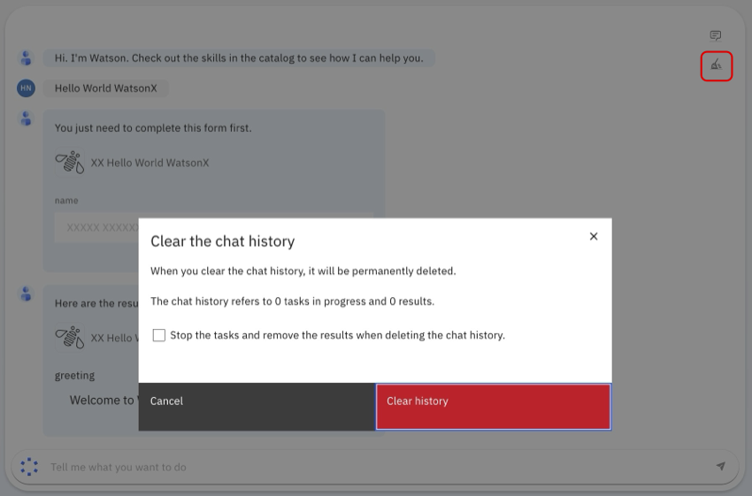

## お疲れさまでした！
このハンズオンでは、watsonx Orchestrateにログインし、カスタムスキルを追加、EnhanceしてからPublishし、カタログに追加しました。そしてカタログからスキルを追加し、チャット画面から呼び出しました。　