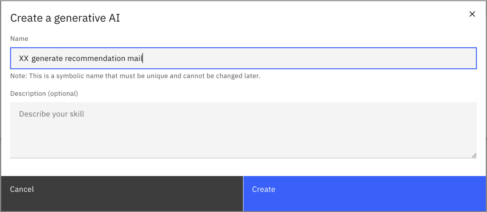

# Lab2 Generative AI
watsonx Orchestrate では、生成AIをカスタムスキルとして外部から呼び出すことが可能ですが、Project(旧 Automation Builder)で生成AIのプロンプトを作成し、スキルとして使用することができます。
このLabでは、顧客の特性に応じてメールを生成するプロンプトを作成します。

## 生成AIを作成してみよう
Skill studioで、まず Project を作成し、そのコンポーネントの1つとして 生成AI のプロンプトを作成することができます。

 1. メニュー(≣)から **Skill studio** を選択します。  
  

 2. 右上にある **Create** ボタンをクリック、**Project** をクリックします。
 

 3. New project のウィンドウで **Create project** を選択し、Name の欄に ***YourInitials*_recommendation** と入力して **Create** をクリックします。  
 

 4. **Generative AI** (生成AI)を選択します。
 

 5. Name の欄に ***YourInitials* generate recommendation mail** と入力して、**Create** をクリックします。
 

 6. Project と 生成AIのコンポーネント が作成されました。生成AIのコンポーネントが作成されると、プロンプト・エディターが開きます。
 

## プロンプトを作成してみよう
プロンプト・エディターを用いて、プロンプトを作成し、出力を生成することができます。

 1. **Prompt** にある **Model:** のプルダウンメニューから、使いたいモデルを選択します。今回は、**mixtral-8x7b-instruct-v01** を選択します。
 

 2. プロンプトを作成します。
    1. **Context** にモデルへの命令文を入力します。今回は、「顧客の特性に応じて、おすすめの観光地を紹介するメール」を生成するプロンプトを作成します。以下の文章を参考に入力します。 (一文ごとに改行してください)   
    ***あなたは、優秀な観光業のマーケターです。***  
    ***観光地のPRをするため、お客様に興味を持ってもらえるメールを送ろうとしています。***  
    ***お客様の特性に合わせて、おすすめの観光地を紹介するメールを日本語で作成してください。***
    

    2.  **Prompt input** には、モデルに応答してほしい文章を入力します。以下の文章を参考に入力します。  
    ***お客様は、20代で、写真撮影が好きです。***
    

    3.  変数を追加します。
     変数は、生成AIの入力として使用されます。変数を使用しない場合も、少なくとも1つの変数を定義する必要があります。
        1. 今回は、以下の３つの変数を作成します。変数の名前と値は String (文字列) でなければなりません。(topic は既存の変数のデフォルト値のみ変更してください。)

            |Variable|Default value|(意味)|(挿入先)|
            |:---:|:---:|--------|---|
            |topic|観光地|おすすめしたいトピック|Context|
            |age|20|お客様の年代|Prompt input|
            |hobby|写真撮影|お客様の趣味|Prompt input|

        2. 変数を追加する場合は、**Variables** の欄で **New variable** をクリックします。
        

        3. 変数に名前を付け、デフォルト値を入力します。設定後は以下のようになっているはずです。 
         

        4. 上の表に従って、**Prompt Input** または **Context** の欄で、プロンプトに変数を挿入します。（文字や数値で書いている部分を変数に置き換えます）
            1. 変数名は、二重の中かっこ {} で囲む必要があります。 (例: {{topic}})
            2. 以下の方法で、変数を自動的に挿入できます。
                - **+** アイコン（Add variable）をクリックし、リストから変数を選択します。
                - 欄内で **Ctrl + スペース** をクリックし、変数を選択します。
            3. 完了すると、以下のような文章になります。
             
            4. **Generate** をクリックします。すると、文章が生成されますが、以下のように途中で切れてしまっているかと思います。これは、トークンが小さいためです。
            

            
    4. **Parameters** の欄でトークンを設定し、生成される出力の長さを制限します。
     トークンは、モデルに対して意味を持つ文字の集合です。プロンプトのテキストは、LLMによって処理される前にトークンに変換されます。
     (**Parameters** および **Variables** のオプション欄は、右上の **×** をクリックして閉じることができます。また、歯車(⚙)マークをクリックして再表示することができます。)
        - デフォルトでは、最小値と最大値はそれぞれ 1 と 50 に設定されています。
        - 最小値を 0 にすることはできません。
        - 最大値の制限は、選択したモデルによって異なります。

        今回は、トークンの最大値 **Max generated tokens** を 1000 に設定します。
        

 3. **Generate** をクリックし、**Generated output** の欄で結果を確認します。今回は、文章を最後まで生成できていることが確認できます。  
   
 未加工のプロンプトを確認することもできます。**Raw prompt** のアイコン () をクリックすると、
 **View raw prompt** が開き、生成された出力を取得するために使用された context や prompt input、training examples を確認できます。  
   
 4. 必要に応じて、より良い結果を得るためにプロンプトを調整します。

## (オプション) Training examples の追加
 プロンプトが生成する出力の精度や品質、安定性を高めるため、プロンプトに例を追加することができます。

 入力と対応する出力のペアを1つ以上指定します。

 1. ページ下部にある **Training examples** の欄で、**New example** をクリックします。
 
 2. 入力と期待される出力を記入します。以下はトレーニングサンプルの例です。
  
    input:
    >お客様は30代で、食べ歩きが好きです。
    
    Expected output:  
     
    >こんにちは。
    今回は、食べ歩きがお好きなあなたへ、国内で食べ歩きできるおすすめの観光地を3つご紹介します！
    
    >1. 小樽  
    >小樽は、レンガ造りの倉庫が並ぶノスタルジックな街です。  
    >北海道の新鮮な海鮮類や、生乳を使ったスイーツを楽しめます！
    
    >2. 川越  
    >川越は、江戸時代の街並みが広がり、着物を着て風情を楽しむこともできます。  
    >名産品であるサツマイモを使ったスイーツが豊富で、食べ歩きしやすい街です！  
    
    >3. 伊勢  
    >伊勢神宮へ参拝する道にある「おかげ横丁」は、日本最大の食べ歩きスポットと言われています。  
    >伊勢名物「赤福」や、松阪牛、伊勢うどんなど、名産品にあふれた食べ歩きスポットです！  
    
    >弊社では、ご紹介した観光地をはじめとして、食べ歩きにおすすめの観光地を巡るツアーを多数ご用意しております！  
    >弊社サイトでも、様々な観光地の魅力や訪問者の声などを掲載しておりますので、ぜひ参考になさってください。  
    >この機会にぜひ、旅行を検討されてみてはいかがでしょうか？

 3. **Generate** をクリックしてプロンプトをテストします。生成された出力の精度が向上しているか確認してみましょう。トレーニングサンプルに基づいた、よりマーケティングのメールらしい文章が生成されています。
 

 **ヒント:** 一般に、指定する入出力のペアが多いほど、結果は良くなります。ただし、例が多すぎる場合は、モデルで許可されている入力の最大トークンと入出力全体の最大トークンのスペースが減ってしまう可能性があります。

## 生成AIを公開してみよう
生成AIのコンポーネントの作成が完了したら、変更を共有し、プロジェクトのバージョンを作成し、スキルとして利用できるように公開します。

 1. リストのスキル名の横にあるアイコンをクリックし、スキルを非公開(Private)から公開(Public)にします。
 公開状態になるとアイコンがになります。 
 

 2. **Share changes** をクリックします。
 

 3. **Share** をクリックします。
 
 ポップアップが出てきたら再度 **Share** をクリックします。
 

 4. シェアが完了したら、**Back to *YourInitials*_recommendation**をクリックし、元のプロンプト・エディターの画面に戻ります。
 

 5. 次に **History** のタブをクリックします。
 

 6. 一番上の行の **Version +** をクリックします。
  

 7. ポップアップが出てきたら、バージョンの名前の欄に **1.0.0** と入力して、**Create** をクリックします。
 

 8. バージョン 1.0.0 が作成されたので、これをスキルとして公開します。**Publish** というタブをクリックします。 
 

 9. バージョン 1.0.0 をクリックすると、下に詳細が表示されます。**Publish** をクリックします。
 
 確認画面が出てくるので、もう一度 **Publish** をクリックします。  

 10. 正常に公開されると、以下のように **Published** と表示されます。
 

 11. 左上のメニュー (≣) から**Skill studio**をクリックして Skill studio に移動し、 **Skills and apps** タブ、**Skills** タブを順にクリックします。
 公開した生成AIのスキルが **Published** の状態で表示されます。右端の ⁝ から**Enhance this skill**を選択します。
 

 12. 複数のタブがある画面が表示されます。左端の**Name**タブはスキルの名前を表しています。
 
 
 13. **Input**タブをクリックします。この画面は、インポートしたスキルを実行する際の入力項目を表しています。  表示項目を日本語にしてみましょう。
 

 14. **Phrases**タブは、チャットからスキルを呼び出すためのフレーズを入力します。多くのフレーズを入力するほど、自然言語からスキルを判断する精度が向上します。日本語で例文を次の３つの文を追加します。

    - `観光地のお勧め文を作成して`
    - `おすすめ観光スポット`
    - `お勧め観光地`

    **Enter(return)** を押すと次の入力域が表示されます。 

    
    
    また、**Auto-generate phrases** をクリックすると、生成AIが自動でフレーズを生成してくれます。  

 15. 他のタブも同様に動作を確認できます。
    - **Output**タブは、スキルの出力を設定できます。スキルの実行結果を表やテキストの形式で出力することができます。
    - **Next Best Skill**タブは、このスキルが使用された後に、次に行うべきスキルとして watsonx Orchestrate が提案するスキルを設定できます。 

 16. 最後に右下の**Publish**を押します。

 17. スキルが公開（publish）できたというメッセージが表示されます。
 
 
 

## 観光地のお勧めメールを生成して、スキルをテストしてみよう   

  このセクションでは、作成したスキルをテストする方法について説明します。 スキルをテストするには、カタログからスキルを追加して実行する必要があります。 このための手順は、以下のとおりです。

 1. 左上にあるメニュー (≣) をクリックし、**Chat**を選択して、チャット画面に移動します。

 2. **Add skills from the catalog** を選択し、前のステップで作成したスキルを選択します。  
  

 3. 検索バーで、`recommendation` を検索します。先ほど作成した***YourInitials*-Recommendation** というAppsを開きます。
  

 4. スキルを追加するためには、**Add skill+**をクリックします。
  

 5. スキルが追加された (`Added`) というメッセージが表示されます。  
  

 6. **Chat** 画面に戻ります。追加したスキルが表示されています。
  

 7. スキルをテストするには、先ほどフレーズとして登録した **おすすめ観光地** をチャット欄に入力します。（該当のスキルをクリックしても実行できます）  
  

 11. トピック の欄に`観光地`、年齢層の欄に`20`、趣味の欄に`写真撮影`を入力します。
 入力が完了したら、**Apply** をクリックします。  
  

 12. スキルが実行されると、進行状況が表示され、`working on it` というメッセージが表示されます。 最後に、観光地のお勧めメールのコンテンツが生成されます。  
  

 13. 以上で、メールのコンテンツを生成するテストは完了です。

## お疲れさまでした！
このLabでは、Skill studioのProjectで生成AIのプロンプトを作成しました。
Context や Prompt input を記入したり、変数を設定したりして、出力を生成しました。
また、トークンや Training examples の調整を行うことで、出力の精度を向上させることができました。

**ご参考：** <a href="https://www.ibm.com/docs/ja/watsonx/watson-orchestrate/current?topic=projects-creating-generative-ai" target="_blank" rel="noopener noreferrer">生成AIについて</a>
         
 