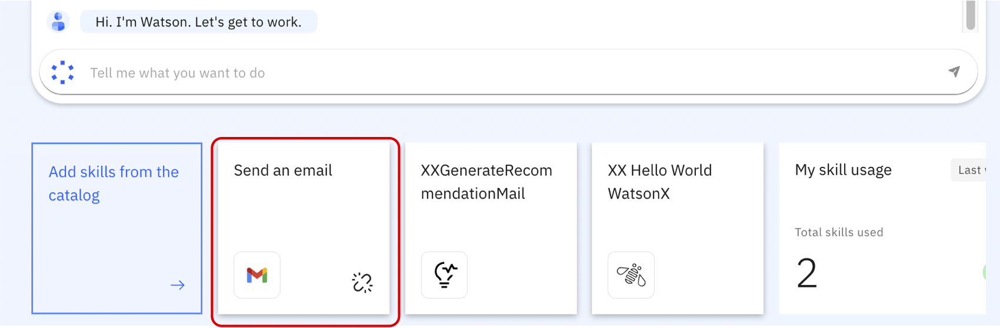
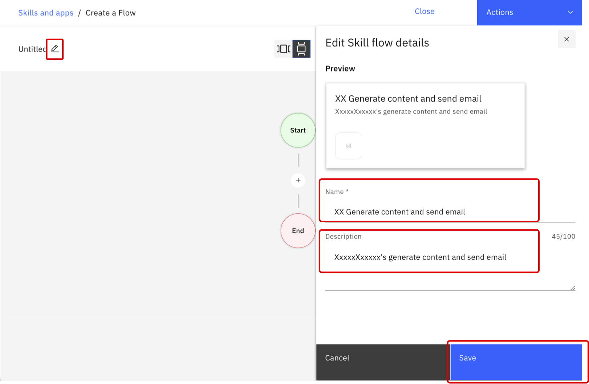
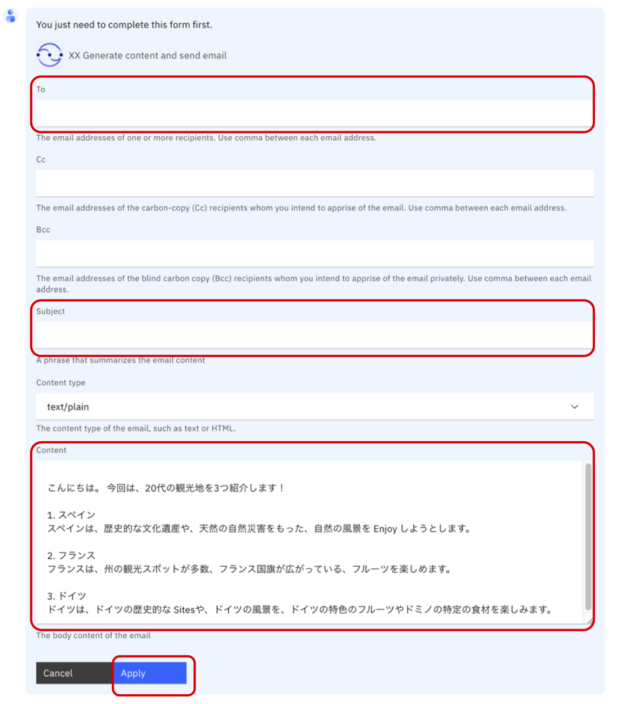

# Lab3 Skill flow

このLabでは、Lab2で作成したコンテンツ生成のスキルと、Gmailでメールを送信するプリビルドスキルを組み合わせて、スキルフローを作成します。

## 前提条件
  - Gmailのアカウント（メールアドレスとパスワード）が必要です。

## カタログからスキルを追加し、Gmailでメールを送ろう
Gmail でメールを送信するスキルは、プリビルドスキルとして既に watsonx Orchestrate にインポートされています。  
このスキルを追加し、Gmail に接続してテストする必要があります。  

 1. いずれかの方法で**Skill catalog**に移動します。
       - **Chat** に移動し **Add skills from the catalog** をクリックする。
       - 左上のメニューから **Skill catalog** を選択する。

 2. Skill catalog において **Gmail** を検索します。
 

 3. **Gmail** のAppsをクリックし、**Send an email from Gmail** の **Add skill** をクリックします。  
 

 4. 表示が **Added** に変わります。
 

 5. **Chat** 画面に移動すると (**Menu** -> **Chat**) 、**Send an email**のスキルが追加されていることが確認できます。
 

 6. これで、**Send an emaill** スキルを追加するセクションは完了です。

## 自身のメールアドレスへメールを送り、スキルをテストしてみよう
このステップでは、スキルを Gmail に接続します。この資格情報(Gmailのアカウント)は、各自で用意してください。

 1. **Chat** 画面にいおて、**Send an email** スキルをの右下にリンク切れのマークが表示されていることが確認できます。これは、スキルがどのメールシステムにも接続されていないことを意味します。  
 

 2. **Send an email** スキルを選択すると、Gmail に接続されていないことが通知されます。 **Connect app** をクリックして Gmail に接続します。  
 

 3. Googleのログイン画面に遷移しますので、アカウント情報を入力してください。
 

 4. **ユーザー本人に代わってメールを送信** にチェックを入れて **続行** をクリックします。
   

 5. アプリが接続されたことが確認できます。
 

 6. **To:** の欄はご自身のメールアドレスを使用します。**Subject** の欄に件名を記入します。（例: `Test send email skill`）**Content** 欄はメール本文を入力します。（例: `Hello and welcome!`）**Apply** ボタンをクリックします。（Gmail接続に使用したアカウントに送信いただいても構いません。）
 

 7. `Here are the results of the Send an email skill.` というメッセージが表示されます。ご自身のメールボックスにメールが送信されているか確認してみてください。
 
 
 8. これで **Send email** スキルをテストするステップは完了です。

## 2つのスキルを組み合わせてスキルフローを作成しよう
これまでは、個々のスキルを作成、追加、テストを行いました。watsonx Orchestrate では、個々のスキルだけでなく、2つ以上のスキルを組み合わせて、スキルフローを作成することができます。 手順は以下のとおりです。

 1. 左上のメニューから **Skill studio** を選択し、**Skill studio** に移動します。

 2. 右上にある**Create**ボタンをクリックし、**Skill Flow**をクリックします。  
   

 3. **鉛筆** アイコンをクリックします。
    1. スキルフローの名前(Name)を設定します。 例: *YourInitials* Generate content and send email
    2. 説明(Description)を設定します。　例: *YourName's* generate content and send email
    3. **Save** をクリックします。
    

 4. スキルを追加するには、**+** をクリックします。***YourInitials*_recommendation** を選択します。
 

 5. ***YourInitials*GenerateRecommendationMail** の **Add skill** をクリックします。
 

 6. このスキルがフローに追加されます。追加したスキルの下にある **+** をクリックし、**Send an email** を追加します。
 

 7. これで、スキルフローが作成されました。全体像は以下のようになります。
 

 8. 生成されたコンテンツをメールで送信するために、1 つ目のスキルの出力を 2 つ目のスキルの入力にマップします。
    1. ***YourInitials*GenerateRecommendationMail**をクリックし、Output タブをクリックし、**text** 形式で出力される**generated_text** があることを確認します。
    
    2. **Send an email** の **richTextBody.Content** に先ほどの***YourInitials*GenerateRecommendationMail** の **generated_text**をマップします。
          1. **Send an email** をクリックして Input タブのを下へスクロールして **richTextBody.Content** を表示させます。
          
          2. **richTextBody.Content** の下の入力エリアをクリックすると、マップできるスキルの候補が表示されます。さらにスキルをクリックすると設定できる項目が表示されます。
          ここでは、***YourInitials*GenerateRecommendationMail**、**generated_text** の順にクリックして設定します。
          
    3. **Actions** -> **Enhance** をクリックして、スキルフローを保存します。確認画面が表示されたら **Save and close** をクリックします。 **Enhance the “*YourInitials* Generate content and send email” skill**の画面が表示されます。
    

       **ご参考：** <a href="https://www.ibm.com/docs/ja/watsonx/watson-orchestrate/current?topic=flows-mapping-values-input-fields" target="_blank" rel="noopener noreferrer">マッピングについて</a>
         
        
 9. スキルを呼び出すフレーズを登録するために、**Enhance the “*YourInitials* Generate content and send email” skill** 画面で **Phrases**をクリックします。
 

 10. 空の欄に **Generate content and send email to YourName** (**YourName** はご自身の名前に変更してください。例: TaroYamada) を入力し、Enter を押します。（**必ず Enter を押す必要があります**）  
 任意でさらにフレーズを追加し、**Publish** ボタンをクリックします。
 

 11. スキルフローを公開すると、スキルが正常に公開されたというメッセージが表示されます。  
   

 12. これで、ここで作成したスキルフローがスキルカタログで表示されるようになっています。以上でこのステップは完了です。
 
## メールを生成し、自身のメールアドレスに送信して、スキルをテストしてみよう
最後に、先ほど組み合わせたスキルフローをテストしてみます。

 1. **Menu** -> **Skills Catalog** に移動します。

 2. 検索欄にご自身のイニシャルや **'*YourInitials* generate content'** などを入力して **Skill flows** が表示されるのでクリックして開きます。
 

 3. 作成したスキルフローの **Add skill** をクリックし、自身のスキルセットに追加します。**Added** と表示されたら、**Chat** 画面に移動します。
 
 **注釈:** 複数のスキルが表示される場合は、ご自身の名前のスキルを選択してください。（必要に応じて検索機能を使ってください）

 4. **Add skill** をクリックし、自身のスキルセットに追加します。**Added** と表示されたら、**Chat** 画面に移動します。
 

 5. 以下のいずれかの方法でスキルを実行します。
    - スキルをクリックして実行します。
    

    - スキルを Enhance する際に設定したフレーズの一部(例：**generate content**) を入力して入力します。
    
    表示された候補から適切な文章を選択します。もし選択した文章と複数のスキルが合致していたら、watsonx Orchestrate はそれらのスキルを候補として提示します。

 6. 観光地のお勧めメール文面を生成するために、**input** に値(例: 観光地、20、写真撮影)を入力しし、**Apply** ボタンをクリックします。
 

 7. 生成された文章が次のスキルの Content の欄にコピーされていることが確認できます。宛先(To)にご自身のメールアドレスを、Subjectに適切なタイトルを入力して **Apply** ボタンをクリックします。
  
 
 8. メールが送られているか、ご自身のメールボックスを確認してください。

## お疲れさまでした！
以上で Lab3 は完了です。このラボでは、 プリビルドスキルを自身のスキルセットに追加し、テストを行いました。  

最後に、それら2つのスキルを組み合わせ、1 つ目のスキルの出力を 2 つ目のスキルの入力にマッピングして、スキルフローを作成しました。

## ご参考
 他にも以下のような設定ができますので、
 <a href="https://www.ibm.com/docs/ja/watsonx/watson-orchestrate/current?topic=skills-combining-into-skill-flows" target="_blank" rel="noopener noreferrer">こちら</a>
 をご参照ください。

 - スキル・フローの使用中に、各スキルの入力フォームや出力フォームをチャットに表示されないようにする。 
 - カスタム・フォームを使用して、入力フォームと出力フォームを定義する。 
 - 入力フォームへのマッピングにおけるデフォルト値の設定、マッピングデータの変換など。
