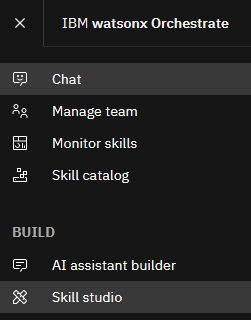

# Lab4 Decision (意思決定の自動化)

このLabでは、watsonx Orchestrateの提供する意思決定の自動化（ルール・エンジン）を実装し、スキルとして呼び出します。
ルールと意思決定表を使用して複雑なビジネス上の意思決定を自動化することで、手作業を削減し、一貫性のある結果を提供することができます。  
例えば、ローン申請者の収入やクレジット・スコアに応じてローンを承認したい場合にはルール・ベースでの意思決定を行うことが有用です。  

## Decisionの作成
Skill studioで、まず Project を作成し、そのコンポーネントの1つとして 生成AI のプロンプトを作成することができます。

 1. メニュー(≣)から **Skill studio** を選択します。  
  

 2. 右上にある **Create** ボタンをクリック、**Project** をクリックします。
 

 3. New project のウィンドウで **Create project** を選択し、Name の欄に ***YourInitials*_Lending_Services** と入力して **Create** ボタンをクリックします。  
 

 4. **Decision** (意思決定の自動化)を選択します。
 

 5. 次にDecisionのモデルを選択します。3つのモデルを選択可能ですが、今回はDecision Modelを作成します。Decision ModelはDMN(Decision Model Notation)と呼ばれる標準の形式で意思決定をモデル化することが可能です。  
 

 6. Decisionの名前を指定します。***YourInitials* Personal Loan** という名前を指定して、**Create** ボタンをクリックしてください。  
 
 
 7. 次のようなDMN形式のダイアグラムが表示されます。
 
     - 緑のノード(Inputノード)はルールによって使用されるデータを表現します。
     - 青いノード(意思決定ノード)は意思決定のステップを表現します。
     - 意思決定ノードにはそのステップで実行されるルールが含まれ、それぞれの意思決定ノードは部分的な意思決定の結果を出力します。
     - 複雑な意思決定には多くの意思決定ノードが含まれ、一つの意思決定ノードの出力が他の意思決定ノードの入力フローとして動作します。  


## Input ノードの実装
このセクションでは、Inputノードの定義をしていきます。

 1. Inputノードをクリックし、右側に表示される編集欄から、Node nameを**applicant name**に変更してください。  
 

 2. Inputノードを追加します。追加方法は次の2通りあります。
    - ①左側にあるパレットからAdd Input Nodeをクリックし、新規にInputノードを追加し、Decisionノードに接続する方法
    - ②Decisionノードにカーソルを重ねると、Decisionノードの上部にパレットが表示されるので、Inputノードをクリックし追加する方法
     
 
 3. 追加されたノードをクリックし、右側の編集欄から、Node nameを**income**に、Output typeを**Integer**にしてください。 
    - 手順2を①で実施した場合
        - incomeノードにカーソルを重ねると、アイコンが表示されので、**Connect to another node**をクリックしてDecisionノードに接続してください。
    - 手順2を②で実施した場合
        - 自動的にDecisionノードに接続されるので、接続作業は不要です。  
 
 
 4. 2-3の手順を繰り返し、以下の表に従って新規ノードを追加してください。  

     |Node name   |Node type|
     |------------|---------|
     |employed    |boolean  |
     |SSN         |string   |
     |loan purpose|string   |
     |credit score|integer  |
 
 5. 意思決定ダイアグラムは以下の様になるはずです。  
   


## ルールの作成
次に、意思決定ノードの中で実行される、承認の意思決定の結果を初期化するためのデフォルト・ルールと、ローンを却下する場合の条件ルールを作成します。ルールは構文形式と意思決定表の形式で記述することが可能です。(日本語を用いることも可能ですが、現在のバージョンではサポートされていないため英語での記述になります。)

 1. 初めに **デフォルト・ルール** を作成します。Decisionノードを選択し、**Logic** タブをクリックします。右上の **＋** ボタンをクリックし、一番下に表示される **Default rule** を選択します。
 
 
 2. 次のような意思決定エディタが表示されるので、string placeholder( **<a string\>**と表示されている場所)をクリックしてドロップダウンから **string** を選択し、**approved**と入力してください。
 
 
 3. 次に、**クレジット・スコアが600以下の申請者の申請はすべて却下するルール**を追加します。Default ruleを選択したときと同様に右上にある+ボタンをクリックして、**Business rule**を選択します。
 

 4. ルールの名前を **decline low credit score** として、**Select the criteria for your rule** で **credit score** を選択してから **create** をクリックしてください。   
 
 
 5. ルールのテンプレートを以下の様に修正します。なお、Ctrl+Space(Macの場合はControl+Space)でコード補完が可能です。  
 
 
 6. (オプション)例えば、無職の場合(employed is false)にローンを却下するなど、入力された値によってローンが却下されるようないくつかのルールを追加してみてください。
     1. 手順は、右上にある+ボタンをクリックして、**Business rule** を選択します。
    
     2. ルールの名前を **decline unemployed** として、**Select the criteria for your rule** で **employed** にチェックをしてから **create** をクリックしてください。
     (デフォルトで、ローンの申請は承認され、ルールは却下する理由を判定することに注意してください。)  
     
    
     3. ルールのテンプレートを以下の様に修正します。なお、Ctrl+Space(Macの場合はControl+Space)でコード補完が可能です。  
     

## 意思決定のテスト
作成した意思決定はテスト・データを指定してテストすることができます。

 1. 右上の**Preview**アイコンをクリックしてください。  
 

 2. **Add test data set**をクリックしてテスト・データを追加します。  
 

 3. 左側に各項目の入力画面が表示されるので、＋をクリックして入力してから **Preview** ボタンをクリックして意思決定の出力を確認してください。
 例えば、**creditScore** に **500** を入力して実行した場合、却下(decilned)されるはずです。  
 


## 意思決定サービスのデプロイ
正しく動作することが確認できたら、スキルとして呼び出せるようにサービスをデプロイします。  

 1. **Back to *YourInitials* Personal Loan** をクリックしてください。  
 
 
 2. リストのスキル名の横にあるアイコンをクリックし、スキルを非公開(Private)から公開(Public)にします。
 公開状態になるとアイコンがになります。 
 

 2. 画面右上にある**Share changes** をクリックします。
 

 3. **Share** をクリックします。
 
 ポップアップが出てきたら再度 **Share** をクリックします。
 

 4. シェアが完了したら、**Back to *YourInitials*_Lending_Services**をクリックし、元のプロンプト・エディターの画面に戻ります。
 

 5. 次に **History** のタブをクリックして表示された **View history** において、一番上の行の **Version +** をクリックします。
 

 7. ポップアップが出てきたら、バージョンの名前の欄に **1.0.0** と入力して、**Create** をクリックします。
 

 8. バージョン 1.0.0 が作成されたので、これをスキルとして公開します。**Publish** というタブをクリックします。 
 

 9. バージョン 1.0.0 をクリックすると、下に詳細が表示されます。**Publish** をクリックします。
 
 確認画面が出てくるので、もう一度 **Publish** をクリックします。  

 10. 正常に公開されると、以下のように **Published** と表示されます。
 

  
## スキルのエンハンス
スキルのエンハンスを行い、各入力パラメータの表示形式や振る舞いを次の様に変更します。

|入力パラメータ|振る舞い            |
|------------|------------------|
|income      |必須               |
|loan purpose|選択肢の設定        |
|credit score|表示ラベルの変更     |
 
 1. 左上のメニュー (≣) から**Skill studio**をクリックして Skill studio に移動し、 **Skills and apps** タブ、**Skills** タブを順にクリックします。
 公開した意思決定のスキル ***YourInitials* Personal Loan** が **Published** の状態で表示されます。右端の ⁝ から**Enhance this skill**を選択します。
 

 2. **Input** タブをクリックし、**income** の **Required** にチェックを入れてください。 
 
 
 3. **loanPurpose** で選択肢を表示するようにします。**loanPurpose** の **Edit response** をクリックして **Options** を選択します。次の3つのOptionを設定してください。
   - **medical emergency**
   - **consolidate debt**
   - **home improvement**
 
 
 4. **creditScore** の表示ラベルを **Provide the Experian credit score** に変更します。
 そのために、**Provide the Label for input parameter creditScore** と書かれいてる箇所に **Provide the Experian credit score** を入力してください。  
 
 
 5. **Publish**をクリックして変更を保存します。  
 

## (オプション) OpenAPI定義を直接編集し、細かな変更を行う
スキルが定義されているOpenAPI定義を直接変更することでより細かい変更が可能です。 

|入力パラメータ|振る舞い            |
|------------|------------------|
|SSN         |非表示             |
|employed    |default value:true|

 1. **Skill studio** に移動し、 **Skills and apps** タブ、**Skills** タブを順にクリックします。
 ***YourInitials* Personal Loan**の右端の ⁝ から **Export this skill** を選択し、スキルをエクスポートし、ローカルにjsonファイルを保存します。 
 
 
 2. メモ帳やエディタなどで保存したファイルを開きます。(実際のファイルは改行が含まれません、必要に応じてお使いのエディタでフォーマットしてください。)  各項目はx-ibmプロパティによって設定されます。x-ibmプロパティの詳細については
 <a href="https://www.ibm.com/docs/ja/watsonx/watson-orchestrate/current?topic=skills-understanding-x-properties" target="_blank" rel="noopener noreferrer">x-ibm プロパティーについて</a>
 を参照してください。
 
 3. **employed** は以下の様に設定されています。**,"default": "true"**となるようにファイルを編集してください。（カンマを含めることを忘れないでください） 
 ```
    "employed": {
                "type": "boolean",
                "x-ibm-order": 3,
                "x-ibm-multiline": "false",
                "default": "true"
                },
 ```
 4. 同様にSSNの部分を修正し、以下の様に **,"x-ibm-show": "false"**を追加してください。
 ```
    "SSN": {
            "type": "string",
            "x-ibm-order": 4,
            "x-ibm-multiline": "false",
            "x-ibm-show": "false"
            },
 ```
 
 5. ファイルを保存します。 
 
 6. **Skill studio** の右上にある **Create** ボタンをクリック、**Import API** をクリックします。  
 
 
 7. **From a file**をクリックし、先ほど保存したファイルをドラッグ＆ドロップするか、クリックして選択してください。  
 
 
 8. ファイルの検証が正しく行われたことを確認し**Next**をクリックします。エラーが表示された場合には、正しく編集されていることを確認してください。  
 
 
 9. 既に存在するスキルをインポートするため、警告が表示されますが、スキルのチェックボックスにチェックをいれ、**Add**をクリックしてスキルを上書きします。  
 
 
 10. スキルの右側のメニューから **Enhance this skill** をクリックし、**Publish**してください。**Status** が **Ready to publish** から **Published**に変わります。
 

## 作成したローン審査のスキルを使用してみよう！
スキルの実行を通じて、エンハンス時に変更した内容が正しく行われていることを確認します。

 1. **Skill catalog** に移動し、検索欄に **Lending** と入力して検索します。表示された ***YourInitials*_Lending_Services** をクリックします。
 
 
 2. ***YourInitials* Personal Loan** の **Add** をクリックしてスキルを追加します。
 
 
 3. **Chat** に移動し、チャットの入力欄に、***YourInitials* Personal Loan** と入力してみてください。 スキルのフォームが表示され、必須項目として設定した **income** のみが表示されていることが確認できます。試しに、**500** を入力しておきましょう。
 
 **Show all fields** をクリックして、他の項目に関する変更についても確認してください。
     - **loanPurpose** をクリックすると選択肢が表示される。
     - 表示ラベルが **Provide the Experian credit score** になっている。
     - (オプション) **SSN** が表示されていない。
     - (オプション) **enployed** にデフォルトでチェックが入っている。
 
 
 4. 値を入力し、正しい結果が返ってくることを確認してください。
 
## お疲れさまでした！
このハンズオンでは、Skill Studioで意思決定サービスを実装し、スキルの入力フォームのカスタマイズ後にチャット画面から呼び出しました。意思決定サービスを用いることで、AIが苦手な根拠のある正確な判断を実行することができます。　

**ご参考：** <a href="https://www.ibm.com/docs/ja/watsonx/watson-orchestrate/current?topic=projects-creating-decisions" target="_blank" rel="noopener noreferrer">意思決定の作成について</a>
<br /> 

## (オプション) 意思決定表の実装
ルールを記述する際には今回のハンズオンで実施したような構文形式のルールの他に、意思決定表による実装も可能です。意思決定表はIf-Thenの組み合わせを表形式で表現するため、多数の条件を表形式で管理したい場合などに有効です。また、エクセルの表などをコピー＆ペーストすることも可能なため、より業務ユーザーが管理しやすいというメリットもあります。このオプションでは、先ほど実装した意思決定に、意思決定表形式の新たなルールを追加します。

 1. ***YourInitials*_Lending_Services** のプロジェクトで、***YourInitials* Personal Loan** のDiagramを開きます。
 

 2. Diagram上で **Decision** をクリックします。
     1. 右側のプロパティ画面の **Logic** タブをクリックして **+** アイコンをクリックしてください。
     2. 意思決定表を作成するため、**Decision table**を選択してください。    
 
 
 3. 今回は、収入(income)に応じた条件をテーブルとして定義してみましょう。Nameとして **Income table** という名前を入力し、使用する条件として **income** を選択して **Create** をクリックしてください。  
 
 
 4. 次のようなテーブルが表示されます。incomeのminとmaxがカラムとして入力可能になっており、それらの条件を満たす場合のDecisionの値をDecision列に記入することが可能です。  
 
 
 6. income列にカーソルを合わせると、次の様に、このカラムで定義されている条件文を確認することが可能です。  
 
 
 7. 条件列のルールは、変更することも可能です。income列のヘッダーを右クリックし、**Define column**を選択してください。ダイアログが表示され、ルールを記述することが可能です。今回は修正を行わないため、**Cancel**をクリックして閉じてください。   
 
 
 8. アクション列のルールも確認してみましょう。アクション列のヘッダーにカーソルを合わせると、カラムに入力した値がdecisionにセットされるという事が分かります。アクション・ルールも先ほどと同様に右クリックして編集することも可能です。意思決定表は条件列がAND条件で評価され、trueの場合にアクション列に定義されたアクションが実行されます。各条件行は個別に評価されます。   
 
 
 9. 次に、incomeが0から10000の場合はdeclinedとなるルールを追加してみましょう。1行目のminに **0**,maxに **10000**,Decisionに **declined** を入力してください。  
 
 
 9. 次にincomeが10000以上の場合にはapprovedとなるルールを追加してみましょう。maxに大きな値を入れることも可能ですが、表の記入形式を変更することも可能です。2行目を右クリックして、**change operator** > **≧**を選択してください。  
 
 
 10. 条件列に **10000** を、アクション列に **approved** を入力してください。  
 
 
 11. 作成したルールのテストをしてみましょう。画面右のプレビューアイコンをクリックしてテスト画面を開き、creditScoreが高く、employedがtrueであっても、incomeが10000以下の場合にローンが却下されることを確認してください。
 