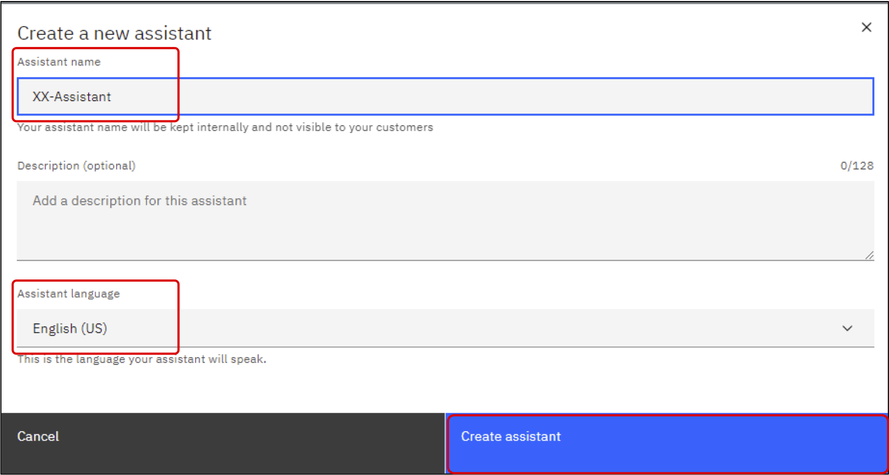
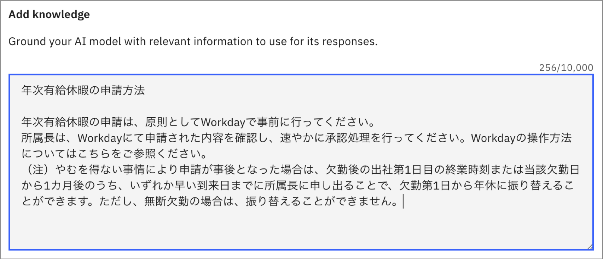
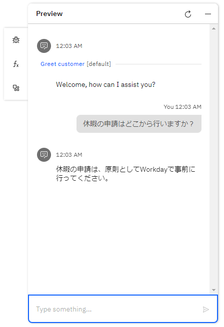

# Lab5 AI Assistant Builder

このLabでは、AI Assistant Builderを用いて、AI Assistantを構築します。生成AIを用いて回答するアクションや、これまでのハンズオンで作成したスキルを呼び出すアクションを定義し、動作を確認します

## AI Assistantの作成

 1. watsonx Orchestrateにログインし、**AI Assistant Builder**をクリックします。もしくは、左上のメニューから**AI Assistant Builder**を選択してください。  
 
 
 2. 画面上部にAssistantのリストがあります。そこを展開し、**Create New ＋**をクリックします。  
 
 
 6. Assistantの作成ダイアログが表示されるので、***YourInitials*-Assistant**という名前を入力し、**Create assistant**をクリックしてください。Assistant Languageとして日本語を選択することも可能ですが、現時点で一部の機能が使用できないため**English**のままにしてください。  
 

 7. Assistantが作成されます。画面下部に全体のアーキテクチャが表示されています。このハンズオンでは、**General purpose**、**AI-guided**、**Skill-based**の3つの動作を確認します。      
 

## LLMによる基本動作の確認
AI AssistantではLLMを用いて回答を生成することが可能です。また、LLMによる回答を望まない場合には、LLMによる一般的な回答を行わないように設定することが可能です。Elastic Searchとの統合を構成することで、検索結果をもとに生成AIで回答を生成するいわゆるRAG(Retrieval Augumented Generation)のパターンを構成することも可能ですが、今回のハンズオンでは行いません。

 1. 左側のリストより、**Generative AI** を選択してください。  
 
 
 2. 以下のような画面が表示されます。この画面からは生成AIに関する設定を行うことが可能です。上部選択リストを展開し、利用可能なLLMを確認してください。今回はデフォルトで設定されている、graniteをそのまま使用します。  
 
 
 3. 右下に表示されているプレビューの入力欄に**What is IBM?**と入力して送信してください。LLMによって一般的な質問に対しての回答が生成されます。　　  
 
 
 4. LLMが一般的な回答を行うかどうかは、**Answer behavior** の **General-purpose answering** で設定することが可能です。右側にあるトグルスイッチをクリックし、OFFにしてください。
 
 
 5. 再びプレビューの入力欄に**What is IBM?**と入力してください。先ほどとは回答が異なることを確認します。  
 
 
 6. **General-purpose answering** をONに戻し、いくつかのLLMを切り替えて、様々な質問をして回答を確認してみてください。  


## AI-Guided Actionの作成
AI-Guilded Actionは特定のインテントにマッチした場合に、LLMによって回答を生成する機能です。インテントごとに細かく生成AIの振る舞いや前提知識を指定することで、RAGと同様に根拠のある回答を行うことが可能です。

 1. 左側のメニューより、**Actions**を選択してください。    
 
 
 2. **Create action +**をクリックしてください。    
 
 
 3. 作成可能な3つのactionが表示されます。**AI-Guilded action**を選択してください。  
 
 
 4. 今回は日本語で動作するアクションを作成してみます。ダイアログが表示されるので、**休暇の申請**と入力し、**Save**をクリックしてください。   
 
 
 5. 左側の **Configuration** をクリックすると設定画面が表示されます。Select modelから使用するLLMを選択することが可能です。今回は**llama3-8b-instruct**を選択してください。  
 
 
 6. **Add knowledge** の欄に以下のテキストをコピー＆ペーストしてください。ここにLLMが動作する際に使用する知識を記入することで、知識に基づいた回答を生成することが可能です。  
 ```
 年次有給休暇の申請方法
 
 年次有給休暇の申請は、原則としてWorkdayで事前に行ってください。
 所属長は、Workdayにて申請された内容を確認し、速やかに承認処理を行ってください。Workdayの操作方法についてはこちらをご参照ください。
 （注）やむを得ない事情により申請が事後となった場合は、欠勤後の出社第1日目の終業時刻または当該欠勤日から1カ月後のうち、いずれか早い到来日までに所属長に申し出ることで、欠勤第1日から年休に振り替えることができます。ただし、無断欠勤の場合は、振り替えることができません。
 ```
 
 
 7. **Add prompt instructions** の欄により詳細な指示を指定することが可能です。今回は日本語で回答することを明示的に指定するため、**日本語で簡潔に回答してください。**と記入してください。  
 
 
 8. 右上のアイコンより変更を保存してください。  
 
 
 8. 右下のチャットのプレビューに **休暇の申請はどこから行いますか？** と記入して送信してください。Add knowledgeに記入した知識を元に回答が適切に生成されることを確認してください。  
 
 
 9. 休暇に関する質問をいくつかして、動作を確認してください。
 
 10. 右上の **x** をクリックして、設定画面を閉じてください。  
 


## Skill based Actionの作成
Skill based actionを用いることで、AI-Assistantからスキルを呼び出すことが可能です。今回はLab4で作成したスキルを呼び出すアクションを定義してみましょう。なお、アプリケーションの接続が必要なスキルは管理者による登録作業が必要です。  

 1. **New action** をクリックしてください。  
 
 
 2. Skill-based actionをクリックしてください。  
 
 
 3. スキルの選択画面が表示されるので、Lab4のハンズオンで作成した ***YourInitials*_Personal_Loan** を選択し、右上の **Next** をクリックしてください。 （Lab4のハンズオンを実施していない場合は任意のスキルを選択してください） 
 
 
 4. **New action** でスキルを呼び出すためのフレーズとなる **ローンの審査** と入力して **Save** をクリックします。
 
 
 5. さきほど入力した **ローンの審査** がフレーズとして登録されていることが確認できます。なお、ここでスキルを呼び出すためのフレーズは追加することができます。複数のフレーズを指定することで認識の精度が高まります。
 
 
 6. 右上のアイコンより変更を保存してください。  
 
 
 7. 右下のチャット・プレビューに **ローンの審査** と記入し、送信してください。スキルが呼び出され入力フォームが表示されます。なお、watsonx Orchestrateでは設定でフォーム入力にするか、チャットで1つづつ入力パラメータを確認するかの設定が可能です。
 <a href="https://www.ibm.com/docs/ja/watsonx/watson-orchestrate/current?topic=actions-defining-how-interact-skill-in-conversation#configuring-multi-turn-conversations" target="_blank" rel="noopener noreferrer">こちら</a>
 をご参照ください。
 
 
 6. 右上の **x** をクリックして、設定画面を閉じてください。  
 

## お疲れさまでした！
AI Assistant Builderを用いてAIアシスタントを実装しました。AI Assistant Builderを用いることで、AI Assistantを迅速に実装することが可能です。また、作成したAI AssitantはWebサイトに埋め込んだり、Slackなどと連携することも可能です。　
AI Assistant Builder については、
<a href="https://www.ibm.com/docs/ja/watsonx/watson-orchestrate/current?topic=building-ai-assistants" target="_blank" rel="noopener noreferrer">こちら</a>
もご参照ください。
