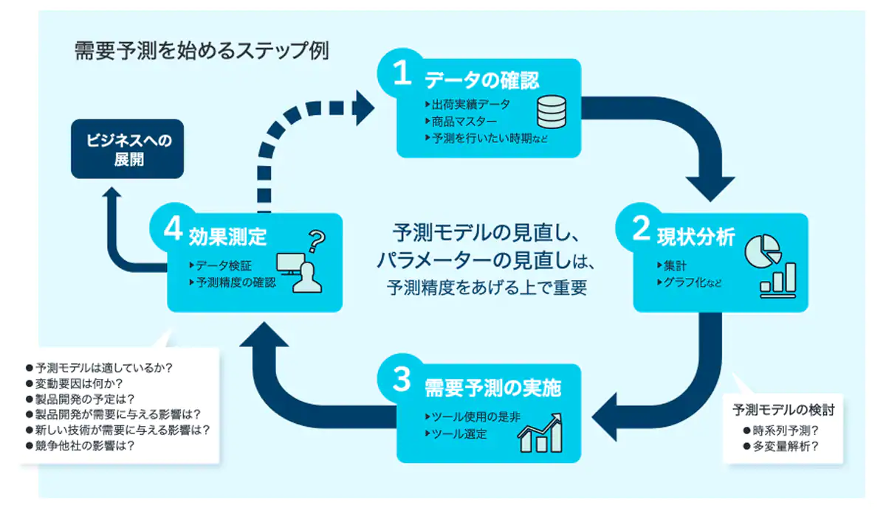

# IBM SPSS Modeler需要予測体験トライアルキット

IBM SPSS Modeler30日間無料トライアルの期間中に、需要予測を体感いただけます。
通常のハンズオンガイドに加えて、ご利用ください。販売実績・地域イベント・気象データから飲料製品の販売数量を予測します。

[SPSS Modelerトライアルダウンロード](https://www.ibm.com/account/reg/signup?formid=urx-19947)

 [『トライアルキット』ダウンロード](https://github.com/IBM/japan-technology/blob/main/webinars/SPSS/spss_modeler%20demand_analytics_trial_kit.zip)
 

## 需要予測
過去の実績データから将来の需要を推測し、迅速に最善のアクションを取ることで収益を最大化します。
国内シェアNo.1の予測分析ソフトIBM SPSS Modelerは、 GUIを使った操作で分析専任者の方はもちろん、現場よく知る業務担当者の方にも簡単にご利用いただけます。
[eBookダウンロード](https://github.com/IBM/japan-technology/blob/main/webinars/SPSS/%E9%9C%80%E8%A6%81%E4%BA%88%E6%B8%AC%E3%82%92%E7%B7%8F%E5%90%88%E7%9A%84%E3%81%AB%E3%82%AB%E3%82%99%E3%82%A4%E3%83%88%E3%82%99%E3%81%99%E3%82%8BeBook.pdf)

